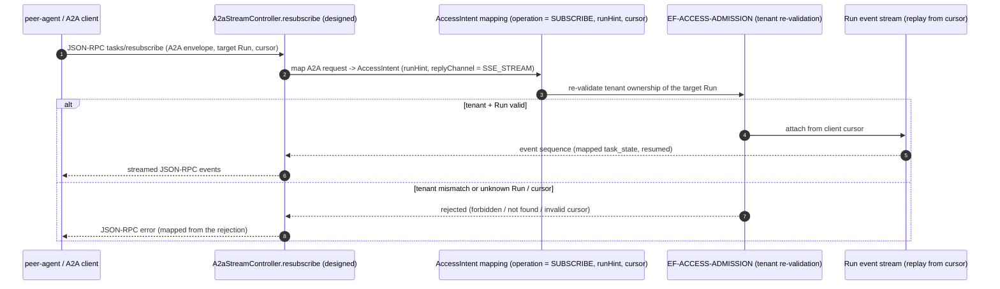

<!--
  ALTITUDE: this is an L2 FunctionPoint spec. It is the method-level detail home
  for ONE FunctionPoint. It is a READABLE INTERPRETATION layer (ADR-0161 /
  Rule 146): it invents no FunctionPoint ID, frame ID, operation ID, status code,
  error code, or method name — every identity is copied from the authoring DSL and
  every fact is cited from the generated facts. Authority cascade:
  generated facts > DSL > Card/prose.

  STATUS: this FunctionPoint is design_only (saa.status = design_only). Its entry
  class is not yet implemented, so it has NO backing code-symbol / test /
  contract-op fact (readiness bar `proposed`, may_lack_facts — see
  docs/governance/feature-readiness-policy.yaml). This spec is the DESIGNED detail
  home; it states what is designed and what is deferred, and cites no fact that
  does not resolve.
-->

# L2 FunctionPoint Spec — `FP-A2A-TASKS-RESUBSCRIBE` (A2A `tasks/resubscribe` stream ingress)

This is the **designed L2 technical-detail home** for the single FunctionPoint
`FP-A2A-TASKS-RESUBSCRIBE`: the A2A (Agent-to-Agent) `tasks/resubscribe` stream
entry that re-attaches a peer-agent (or A2A client) to an existing Run's event
stream from a client-held cursor, through the agent-service Access and Admission
frame. The FunctionPoint is `design_only` — no production handler ships yet — so
this spec describes the **designed** entry, I/O, sequence, and contract, and marks
the code / test evidence as deferred. It duplicates no shipped wire detail.

> **This document is a READABLE INTERPRETATION layer (Rule 146 / E196).** It
> invents no FunctionPoint ID, frame ID, operation ID, status code, error code, or
> method name. Every identity is copied from the authoring DSL; every fact is
> cited from the generated facts. Where this prose and the DSL disagree, the DSL
> wins; where the DSL and the generated facts disagree, the generated facts win
> (cascade: `generated facts > DSL > Card/prose`).

## Authority chain (read top-down)

1. **FunctionPoint identity (authoring DSL)** — element `fpA2aTasksResubscribe`
   (`saa.id` = `FP-A2A-TASKS-RESUBSCRIBE`) in
   [`../../../features/function-points.dsl`](../../../features/function-points.dsl).
   Its `saa.status`, `saa.channel`, `saa.actor`, `saa.trigger`, `saa.sourceAdr`,
   `saa.code_entrypoint_refs`, and `saa.contract_op_refs` are copied verbatim into
   §1–§2; this spec adds no property the element does not declare. The element
   declares no `saa.requirement` — the value-axis requirement binding is deferred
   (see §1).
2. **Owning EngineeringFrame (structural parent)** — `EF-ACCESS-ADMISSION`
   (element `efAccessAdmission`, owner `agent-service`) holds the `anchors` edge
   `efAccessAdmission -> fpA2aTasksResubscribe` in
   [`../../../features/engineering-frames.dsl`](../../../features/engineering-frames.dsl).
   Frame Card: [`../../L1/frames/EF-ACCESS-ADMISSION.md`](../../L1/frames/EF-ACCESS-ADMISSION.md)
   §6 records this FunctionPoint as `design_only`, anchored but not yet
   fact-backed.
3. **Generated facts (binding factual authority)** — none yet. The designed entry
   class `A2aStreamController` is not present in
   [`../../../facts/generated/code-symbols.json`](../../../facts/generated/code-symbols.json),
   so this spec cites no `code-symbol/*`, `test/*`, or `contract-op/*` anchor for
   the handler. Facts are never hand-edited; they will appear when the handler is
   extracted by `tools/architecture-workspace`.
4. **Contract surface (binding wire / SPI authority)** — the designed ingress data
   contract [`../../../../docs/contracts/access-intent.v1.yaml`](../../../../docs/contracts/access-intent.v1.yaml)
   (`contract-yaml/access-intent`, `status: design_only`, ADR-0155) and the A2A
   protocol-envelope contract
   [`../../../../docs/contracts/a2a-envelope.v1.yaml`](../../../../docs/contracts/a2a-envelope.v1.yaml)
   (`contract-yaml/a2a-envelope`, `status: design_only`, ADR-0100). These are
   schema contracts (no `contract-op/*` operation fact), cited by path and by their
   `contract-yaml/*` fact id (§6).
5. **L0 constraint authority** — the L0 §4 protocol-convergence /
   tenant-cross-check invariant that names the admission boundary without carrying
   its per-protocol stream detail. This spec carries the designed detail; L0 keeps
   the invariant.

---

## 1. Behavior

`FP-A2A-TASKS-RESUBSCRIBE` is designed to realize **one behaviour**: convert an
inbound A2A `tasks/resubscribe` call from a peer agent (or an A2A-speaking client)
into a tenant-re-validated **re-attachment** to an existing Run's event stream,
resuming delivery from a client-held cursor without re-running the Run, or reject
it at the edge. A2A interoperability is achieved by **mapping** the A2A request
onto the internal subscribe intent at the contract boundary, never by importing an
A2A SDK (ADR-0100 contract-only adoption).

On the structural axis it is `agent-service -> EF-ACCESS-ADMISSION ->
FP-A2A-TASKS-RESUBSCRIBE`. The value-axis chain (`ProductClaim -> Requirement ->
Feature -> FunctionPoint`) is **deferred**: the DSL element declares no
`saa.requirement`, and no Feature `requires` this FunctionPoint yet. The source
ADR-0155 carries product claim `PC-003`; a binding `REQ-*` / `Feature -> requires`
edge lands when the FunctionPoint is promoted past `design_only` (readiness bar
`proposed`, `may_lack_facts` — `docs/governance/feature-readiness-policy.yaml`).

| Field | Value (copied from the DSL element) |
|---|---|
| FunctionPoint ID | `FP-A2A-TASKS-RESUBSCRIBE` |
| Status | `design_only` (`saa.status`) — no production handler ships yet |
| Owning EngineeringFrame | `EF-ACCESS-ADMISSION` (the `anchors` parent) |
| Owner module | `agent-service` (`saa.owner`) |
| Requirement | *(none declared — value-axis binding deferred)* |
| Channel | `http` (`saa.channel`) — A2A JSON-RPC over HTTP, streamed reply |
| Actor | `tenant-developer-or-peer-agent` (`saa.actor`) |
| Trigger | `A2A JSON-RPC POST tasks/resubscribe` (`saa.trigger`) |
| Source ADR | `ADR-0155` (`saa.sourceAdr`) |

> **Maturity note (design_only, not a contradiction).** The FunctionPoint is an
> ADR-0155 M1 v1.2-absorption placeholder (Access Layer AL-06 cursor / stream
> flow). Its `saa.code_entrypoint_refs` points at a *planned* class
> (`A2aStreamController#resubscribe`) that does not exist yet — a deliberately
> placeholder path, acceptable for `design_only` (ADR-0155 verification, Rule
> G-15.d). The designed re-subscription reuses the shipped tenant re-validation;
> only the protocol-ingress adapter and the cursor-replay binding are new. No
> behavioural fact is cited until the adapter ships.

## 2. I/O

> Designed I/O. Types and operation ids below are the **designed** carriers from
> the contract schemas; none is a resolving `code-symbol/*` yet.

- **Input** — an A2A `tasks/resubscribe` request, mapped at the boundary onto the
  `AccessIntent` ingress carrier with `operation = SUBSCRIBE`
  (`access-intent.v1.yaml`, the `saa.contract_op_refs`
  `access-intent.v1.yaml#operation=SUBSCRIBE` on the DSL element). A non-SUBMIT
  operation requires `runHint` (the target Run id) on the `AccessIntent` carrier;
  `replyChannel = SSE_STREAM` selects the streamed reply (access-intent
  `replyChannel` enum), and the client-held cursor identifies the resume position.
- **Output (success)** — a streamed sequence of the target Run's events, each
  carrying the A2A `task_state` mapped from the internal Run state through
  a2a-envelope `mapping.outbound` (`RUNNING -> working`,
  `SUSPENDED(AwaitClientCallback) -> input_required`, `SUCCEEDED -> completed`,
  `FAILED|EXPIRED|CANCELLED -> failed`), resuming after the client cursor. The wire
  stream schema is designed, not yet a `code-symbol/*` response type.
- **Side effects** — none owned by this FunctionPoint beyond establishing the
  read-side stream subscription. Re-subscription is a **read/replay** path: it does
  not transition the Run and owns no state write. The Run's event history and
  cursor semantics are owned by the Run aggregate / event-stream detail, cited not
  inlined.

## 3. Runtime Sequence

> Designed sequence. Participants that name a class are designed entry points, not
> yet resolving `code-symbol/*` facts; the boundary hops reuse the shipped tenant
> re-validation of `EF-ACCESS-ADMISSION`.

The tenant re-validation is the **shipped** admission check the Access and
Admission frame already enforces (`FP-TENANT-CROSS-CHECK`); this designed sequence
reuses it rather than minting a new one. The cursor-replay semantics are the Run
event-stream detail, not this frame's to own.

## 4. Class / Method Anchors (from facts)

This FunctionPoint is `design_only`: its handler is not implemented, so there is
**no resolving `code-symbol/*` fact** to cite. The DSL element declares the
*planned* entry pointer below as `saa.code_entrypoint_refs`; it is a placeholder
path (Rule G-15.d), not yet a fact id.

| Role | Designed symbol | Fact id |
|---|---|---|
| Entry (planned, `saa.code_entrypoint_refs`) | `A2aStreamController.resubscribe` | *(none — `agent-service/.../web/a2a/A2aStreamController.java#resubscribe` is a planned path, not yet in `code-symbols.json`)* |

A fact-cited anchor table lands here when the handler ships and is extracted into
[`../../../facts/generated/code-symbols.json`](../../../facts/generated/code-symbols.json).
Until then no `code-symbol/*` is asserted (Rule 146 — a minted, non-resolving fact
id is a violation).

## 5. Error Paths

> Designed error mapping. The A2A error surface is JSON-RPC; the causes reuse the
> rejections the admission path already enforces. No `response_status_codes` fact
> is cited (no `contract-op/*` exists for this design_only FP).

| Cause (observable) | Outcome | Signal | Mapped from |
|---|---|---|---|
| Missing / unknown target Run (`runHint` absent or not found) | rejected at boundary | JSON-RPC error | access-intent `runHint`-required-for-non-SUBMIT |
| `JWT.tenant` claim disagrees with the target Run's tenant | rejected at tenant re-validation | JSON-RPC error | `FP-TENANT-CROSS-CHECK` rejection (designed reuse) |
| Invalid / expired client cursor for the target Run | re-subscription refused | JSON-RPC error | Run event-stream cursor validation (designed) |

The concrete JSON-RPC error codes and the A2A↔internal status mapping are fixed
when the handler and its contract op ship; they are **not** minted here (no
backing fact yet).

## 6. Contracts

`FP-A2A-TASKS-RESUBSCRIBE` speaks the A2A JSON-RPC protocol mapped onto the
internal `AccessIntent` ingress contract. Both surfaces are **schema** contracts at
`status: design_only` — neither carries a `contract-op/*` operation fact yet.

| Surface | Fact id | Contract source | Designed role | Status |
|---|---|---|---|---|
| Ingress intent (internal) | `contract-yaml/access-intent` | `docs/contracts/access-intent.v1.yaml` | `operation = SUBSCRIBE` ingress carrier (the DSL `saa.contract_op_refs` `access-intent.v1.yaml#operation=SUBSCRIBE`) | `design_only` (not runtime-enforced) |
| A2A protocol envelope (wire) | `contract-yaml/a2a-envelope` | `docs/contracts/a2a-envelope.v1.yaml` | A2A envelope shape + Task-state vocabulary + internal-state mapping | `design_only` (not runtime-enforced) |

- Both `contract-yaml/*` fact ids resolve in
  [`../../../facts/generated/contract-surfaces.json`](../../../facts/generated/contract-surfaces.json);
  the binding wire authority is the contract documents themselves (cited above).
- There is **no `contract-op/*`** for this FunctionPoint: the A2A JSON-RPC
  operation is not extracted as an HTTP/OpenAPI operation, and the ingress carrier
  is a data schema, not an operation. The `saa.contract_op_refs`
  `access-intent.v1.yaml#operation=SUBSCRIBE` is a *field-value selector* into the
  data contract, not a `contract-op/*` fact id.

## 7. Tests

This FunctionPoint is `design_only`. **Tests: deferred** — no `test/*` fact
exists; the DSL element declares no `saa.test_refs`, and
[`../../../features/verification.dsl`](../../../features/verification.dsl) records
no `verifies` edge for `fpA2aTasksResubscribe`. Verification is designed (an A2A
stream-ingress contract test mapping the re-subscribe request onto a cursor-resumed
event stream) but not yet implemented. A fact-cited three-layer test table
(Rule D-4) lands when the handler ships; no non-resolving `test/*` ref is cited
until then.

## 8. Gates

| Concern | Gate rule / enforcer | What it blocks |
|---|---|---|
| FunctionPoint element well-formedness | Rule G-14 / Rule G-15.d | a profile-tagged FP element missing a required `saa.*` property; for a `design_only` `http` FP, missing `code_entrypoint_refs[]` (a placeholder path is accepted). |
| design_only frame MAY anchor without ship evidence | Rule G-23 | a `shipped`-promoted frame anchoring zero FunctionPoints; a `design_only` anchor (this FP) is permitted without backing facts. |
| Card / spec is a readable interpretation | Rule 146 / E196 | a citation here (`code-symbol/*`, `test/*`, `contract-op/*`, method descriptor) that does not resolve in the generated facts, or an FP/frame relationship not present in the DSL. |
| No L2 detail left upstream | Rule 145 / E194-E195 | the per-protocol stream mapping / sequence / cursor detail this spec carries being left in L0 / L1 prose instead. |
| FunctionPoint readiness | Rule 147 / E197 (kernel Rule G-30) | a FunctionPoint marked **ready** whose axis obligations are absent. At `design_only` the readiness bar is `proposed` (`may_lack_facts`): this spec asserts no readiness it cannot evidence — `gate/lib/check_feature_readiness.py`, ADVISORY at the ADR-0159 §13.3 landing rung. |

---

## What stays upstream (NOT carried here)

Per the layer-purity keep-list, the following remain at L0 / L1 and are only
*referenced* here, never duplicated (Rule 145):

- the L0 §4 protocol-convergence + tenant-cross-check *invariant* (every protocol
  ingress re-validates tenant ownership) — L0 owns the invariant; this spec owns
  the designed A2A re-subscribe verb, mapping, and stream sequence;
- naming `EF-ACCESS-ADMISSION` / `com.huawei.ascend.service.platform.web` as the
  boundary identity and the development-view package decomposition of the owning
  module (L1 / Frame Card material — `EF-ACCESS-ADMISSION.md` §6 records this FP's
  `design_only` anchor);
- the shipped tenant re-validation this designed sequence reuses, and the Run
  event-stream / cursor-replay semantics — owned by the sibling FunctionPoint specs
  and the Run-aggregate detail, cited above;
- citing the ArchUnit / gate enforcer that pins the boundary (named in §8, not
  re-specified).

## Authority

- ADR-0068 — Layered 4+1 + Architecture Graph as twin sources of truth.
- ADR-0155 — agent-service L1 v1.2 internal module design (the M1 Access Layer
  absorption that registers this `design_only` FunctionPoint).
- ADR-0100 — A2A contract-only adoption (the A2A envelope + Task-state vocabulary
  contract, no SDK dependency).
- ADR-0161 — EngineeringFrame package-cluster anchor + Card over DSL.
- Rule 33 — Layered 4+1 Discipline; Rule 145 — L2 detail sink; Rule 146 — Frame
  Card / FunctionPoint-spec is a readable interpretation (`CLAUDE.md`).
- L2 corpus index: [`../README.md`](../README.md).
