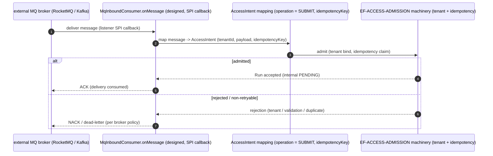

<!--
  ALTITUDE: this is an L2 FunctionPoint spec. It is the method-level detail home
  for ONE FunctionPoint. It is a READABLE INTERPRETATION layer (ADR-0161 /
  Rule 146): it invents no FunctionPoint ID, frame ID, operation ID, status code,
  error code, or method name — every identity is copied from the authoring DSL and
  every fact is cited from the generated facts. Authority cascade:
  generated facts > DSL > Card/prose.

  STATUS: this FunctionPoint is design_only (saa.status = design_only). Its entry
  class is not yet implemented, so it has NO backing code-symbol / test /
  contract-op fact (readiness bar `proposed`, may_lack_facts — see
  docs/governance/feature-readiness-policy.yaml). This spec is the DESIGNED detail
  home; it states what is designed and what is deferred, and cites no fact that
  does not resolve.
-->

# L2 FunctionPoint Spec — `FP-MQ-INBOUND` (broker to inbound consumer admission)

This is the **designed L2 technical-detail home** for the single FunctionPoint
`FP-MQ-INBOUND`: the message-queue inbound consumer that admits a broker-delivered
message (RocketMQ / Kafka, via a message-listener SPI) into the agent-service
Access and Admission frame. The FunctionPoint is `design_only` — no production
consumer ships yet — so this spec describes the **designed** entry, I/O, sequence,
and contract, and marks the code / test evidence as deferred. It duplicates no
shipped wire detail.

> **This document is a READABLE INTERPRETATION layer (Rule 146 / E196).** It
> invents no FunctionPoint ID, frame ID, operation ID, status code, error code, or
> method name. Every identity is copied from the authoring DSL; every fact is
> cited from the generated facts. Where this prose and the DSL disagree, the DSL
> wins; where the DSL and the generated facts disagree, the generated facts win
> (cascade: `generated facts > DSL > Card/prose`).

## Authority chain (read top-down)

1. **FunctionPoint identity (authoring DSL)** — element `fpMqInbound`
   (`saa.id` = `FP-MQ-INBOUND`) in
   [`../../../features/function-points.dsl`](../../../features/function-points.dsl).
   Its `saa.status`, `saa.channel`, `saa.actor`, `saa.trigger`, `saa.sourceAdr`,
   `saa.code_entrypoint_refs`, and `saa.contract_op_refs` are copied verbatim into
   §1–§2; this spec adds no property the element does not declare. The element
   declares no `saa.requirement` — the value-axis requirement binding is deferred
   (see §1).
2. **Owning EngineeringFrame (structural parent)** — `EF-ACCESS-ADMISSION`
   (element `efAccessAdmission`, owner `agent-service`) holds the `anchors` edge
   `efAccessAdmission -> fpMqInbound` in
   [`../../../features/engineering-frames.dsl`](../../../features/engineering-frames.dsl).
   Frame Card: [`../../L1/frames/EF-ACCESS-ADMISSION.md`](../../L1/frames/EF-ACCESS-ADMISSION.md)
   §6 records this FunctionPoint as `design_only`, anchored but not yet
   fact-backed.
3. **Generated facts (binding factual authority)** — none yet. The designed entry
   class `MqInboundConsumer` is not present in
   [`../../../facts/generated/code-symbols.json`](../../../facts/generated/code-symbols.json),
   so this spec cites no `code-symbol/*`, `test/*`, or `contract-op/*` anchor for
   the consumer. Facts are never hand-edited; they will appear when the consumer is
   extracted by `tools/architecture-workspace`.
4. **Contract surface (binding wire / SPI authority)** — the designed ingress data
   contract [`../../../../docs/contracts/access-intent.v1.yaml`](../../../../docs/contracts/access-intent.v1.yaml)
   (`contract-yaml/access-intent`, `status: design_only`, ADR-0155). This is a
   schema contract (no `contract-op/*` operation fact), cited by path and by its
   `contract-yaml/*` fact id (§6). The broker wire protocol (RocketMQ / Kafka) is
   external; the in-process boundary is the consumer SPI type named in §4.
5. **L0 constraint authority** — the L0 §4 protocol-convergence /
   tenant-cross-check invariant that names the admission boundary without carrying
   its per-transport delivery detail. This spec carries the designed detail; L0
   keeps the invariant.

---

## 1. Behavior

`FP-MQ-INBOUND` is designed to realize **one behaviour**: convert a single
broker-delivered inbound message into exactly one tenant-bound, idempotency-decided
admission into agent-service — the asynchronous, broker-fed sibling of the native
`POST /v1/runs` create verb (`FP-CREATE-RUN`) — or negatively acknowledge /
dead-letter it. The message-queue transport is reached through a **message-listener
SPI** (the broker library calls in; agent-service does not depend on a specific
broker), and the inbound message is mapped onto the internal admission model at the
contract boundary.

On the structural axis it is `agent-service -> EF-ACCESS-ADMISSION ->
FP-MQ-INBOUND`. The value-axis chain (`ProductClaim -> Requirement -> Feature ->
FunctionPoint`) is **deferred**: the DSL element declares no `saa.requirement`, and
no Feature `requires` this FunctionPoint yet. The source ADR-0155 carries product
claim `PC-003`; a binding `REQ-*` / `Feature -> requires` edge lands when the
FunctionPoint is promoted past `design_only` (readiness bar `proposed`,
`may_lack_facts` — `docs/governance/feature-readiness-policy.yaml`).

| Field | Value (copied from the DSL element) |
|---|---|
| FunctionPoint ID | `FP-MQ-INBOUND` |
| Status | `design_only` (`saa.status`) — no production consumer ships yet |
| Owning EngineeringFrame | `EF-ACCESS-ADMISSION` (the `anchors` parent) |
| Owner module | `agent-service` (`saa.owner`) |
| Requirement | *(none declared — value-axis binding deferred)* |
| Channel | `spi` (`saa.channel`) — broker-fed message-listener SPI |
| Actor | `external-mq-broker` (`saa.actor`) |
| Trigger | `Broker delivery (RocketMQ / Kafka SPI)` (`saa.trigger`) |
| Source ADR | `ADR-0155` (`saa.sourceAdr`) |

> **Maturity note (design_only, not a contradiction).** The FunctionPoint is an
> ADR-0155 M1 v1.2-absorption placeholder (Access Layer AL-02 inbound consumer,
> "M1 v1.2"). Its `saa.code_entrypoint_refs` points at a *planned* class
> (`MqInboundConsumer#onMessage`) that does not exist yet — a placeholder path,
> acceptable for `design_only` (ADR-0155 verification). Unlike the three A2A
> FunctionPoints, this is an `spi`-channel inbound: the broker is the actor and the
> boundary is a listener SPI, not an HTTP route. The designed admission reuses the
> shipped tenant / idempotency machinery of `EF-ACCESS-ADMISSION`; only the
> broker-listener adapter is new. No behavioural fact is cited until the adapter
> ships.

## 2. I/O

> Designed I/O. Types and operation ids below are the **designed** carriers from
> the contract schema; none is a resolving `code-symbol/*` yet.

- **Input** — a broker-delivered message (RocketMQ / Kafka), handed to the consumer
  by a message-listener SPI callback, mapped at the boundary onto the `AccessIntent`
  ingress carrier with `operation = SUBMIT` (`access-intent.v1.yaml`, the
  `saa.contract_op_refs` `access-intent.v1.yaml#operation=SUBMIT` on the DSL
  element). The message must supply the `AccessIntent` required fields — `tenantId`,
  `principal`, `payload`, `replyChannel`, `traceCtx` — and an `idempotencyKey` to
  participate in the replay decision (access-intent `idempotencyKey` is required for
  SUBMIT).
- **Output (success)** — no synchronous wire response; the consumer admits the Run
  and acknowledges the broker delivery. Any client reply travels on the
  `AccessIntent` `replyChannel` (designed `MQ_REPLY` for the broker-fed path), not
  as a return value of the SPI callback. The acknowledgement contract is the broker
  library's, not an agent-service `code-symbol/*` response type.
- **Side effects** — the designed admission records an idempotency claim and
  persists one Run through the **same** admission machinery `EF-ACCESS-ADMISSION`
  already owns for `FP-CREATE-RUN`; this FunctionPoint adds the broker-listener
  adapter in front of that machinery, it does not own a second persistence path.
  Persistence mechanics are owned by the Run-aggregate L2 detail, cited not inlined.

## 3. Runtime Sequence

> Designed sequence. Participants that name a class are designed entry points, not
> yet resolving `code-symbol/*` facts; the boundary hops reuse the shipped
> admission SPIs of `EF-ACCESS-ADMISSION`.

The tenant bind and idempotency claim/replay hops are the **shipped** admission
FunctionPoints (`FP-TENANT-CROSS-CHECK`, `FP-IDEMPOTENCY-CLAIM`) the Access and
Admission frame already anchors; this designed sequence reuses them rather than
minting new ones. Broker ACK / NACK / dead-letter policy is the transport adapter's
detail, not this frame's invariant.

## 4. Class / Method Anchors (from facts)

This FunctionPoint is `design_only`: its consumer is not implemented, so there is
**no resolving `code-symbol/*` fact** to cite. The DSL element declares the
*planned* entry pointer below as `saa.code_entrypoint_refs`; it is a placeholder
path (ADR-0155), not yet a fact id.

| Role | Designed symbol | Fact id |
|---|---|---|
| Entry (planned, `saa.code_entrypoint_refs`) | `MqInboundConsumer.onMessage` | *(none — `agent-service/.../dispatcher/mq/MqInboundConsumer.java#onMessage` is a planned path, not yet in `code-symbols.json`)* |

A fact-cited anchor table lands here when the consumer ships and is extracted into
[`../../../facts/generated/code-symbols.json`](../../../facts/generated/code-symbols.json).
Until then no `code-symbol/*` is asserted (Rule 146 — a minted, non-resolving fact
id is a violation).

## 5. Error Paths

> Designed error mapping. The `spi` channel has no HTTP wire; non-success outcomes
> are broker ACK/NACK/dead-letter decisions driven by the admission result. No
> `response_status_codes` fact is cited (no `contract-op/*` exists for this
> design_only FP).

| Cause (observable) | Outcome | Signal | Mapped from |
|---|---|---|---|
| Malformed message (missing required `AccessIntent` field) | rejected, non-retryable | NACK / dead-letter | access-intent required-field validation |
| Message tenant cannot be bound / cross-checked | rejected at tenant bind | NACK / dead-letter | `FP-TENANT-CROSS-CHECK` rejection (designed reuse) |
| Reused `idempotencyKey` (duplicate delivery) | duplicate suppressed, idempotent ACK | ACK (no second Run) | `FP-IDEMPOTENCY-CLAIM` decision (designed reuse) |

The concrete NACK / dead-letter policy and retry budget are fixed when the consumer
and its broker binding ship; they are **not** minted here (no backing fact yet).

## 6. Contracts

`FP-MQ-INBOUND` consumes an `spi`-channel broker delivery mapped onto the internal
`AccessIntent` ingress contract. The ingress carrier is a **schema** contract at
`status: design_only` — it carries no `contract-op/*` operation fact.

| Surface | Fact id | Contract source | Designed role | Status |
|---|---|---|---|---|
| Ingress intent (internal) | `contract-yaml/access-intent` | `docs/contracts/access-intent.v1.yaml` | `operation = SUBMIT` ingress carrier (the DSL `saa.contract_op_refs` `access-intent.v1.yaml#operation=SUBMIT`) | `design_only` (not runtime-enforced) |

- The `contract-yaml/access-intent` fact id resolves in
  [`../../../facts/generated/contract-surfaces.json`](../../../facts/generated/contract-surfaces.json);
  the binding wire authority is the contract document itself (cited above).
- There is **no `contract-op/*`** for this FunctionPoint, and no external
  HTTP/AsyncAPI operation surface: this is an `spi`-channel inbound whose contract
  is the broker-listener SPI type (the designed `MqInboundConsumer`, §4) plus the
  `AccessIntent` data schema it maps onto. The `saa.contract_op_refs`
  `access-intent.v1.yaml#operation=SUBMIT` is a *field-value selector* into the data
  contract, not a `contract-op/*` fact id.

## 7. Tests

This FunctionPoint is `design_only`. **Tests: deferred** — no `test/*` fact
exists; the DSL element declares no `saa.test_refs`, and
[`../../../features/verification.dsl`](../../../features/verification.dsl) records
no `verifies` edge for `fpMqInbound`. Verification is designed (a broker-listener
ingress contract test mapping a delivered message onto the admission decision, plus
a duplicate-delivery idempotency test) but not yet implemented. A fact-cited
three-layer test table (Rule D-4) lands when the consumer ships; no non-resolving
`test/*` ref is cited until then.

## 8. Gates

| Concern | Gate rule / enforcer | What it blocks |
|---|---|---|
| FunctionPoint element well-formedness | Rule G-14 / Rule G-15.d | a profile-tagged FP element missing a required `saa.*` property; an `spi`-channel FP declares its entry via `code_entrypoint_refs[]` (a placeholder path is accepted for `design_only`). |
| design_only frame MAY anchor without ship evidence | Rule G-23 | a `shipped`-promoted frame anchoring zero FunctionPoints; a `design_only` anchor (this FP) is permitted without backing facts. |
| Card / spec is a readable interpretation | Rule 146 / E196 | a citation here (`code-symbol/*`, `test/*`, `contract-op/*`, method descriptor) that does not resolve in the generated facts, or an FP/frame relationship not present in the DSL. |
| No L2 detail left upstream | Rule 145 / E194-E195 | the broker-ingress mapping / sequence / ACK-policy detail this spec carries being left in L0 / L1 prose instead. |
| FunctionPoint readiness | Rule 147 / E197 (kernel Rule G-30) | a FunctionPoint marked **ready** whose axis obligations are absent. At `design_only` the readiness bar is `proposed` (`may_lack_facts`): this spec asserts no readiness it cannot evidence — `gate/lib/check_feature_readiness.py`, ADVISORY at the ADR-0159 §13.3 landing rung. |

---

## What stays upstream (NOT carried here)

Per the layer-purity keep-list, the following remain at L0 / L1 and are only
*referenced* here, never duplicated (Rule 145):

- the L0 §4 protocol-convergence + tenant-cross-check *invariant* (every transport
  ingress converges to one tenant-bound admission) — L0 owns the invariant; this
  spec owns the designed broker-ingress mapping and sequence;
- naming `EF-ACCESS-ADMISSION` / `com.huawei.ascend.service.platform.web` as the
  boundary identity and the development-view package decomposition of the owning
  module (L1 / Frame Card material — `EF-ACCESS-ADMISSION.md` §6 records this FP's
  `design_only` anchor);
- the shipped admission machinery (tenant bind, idempotency claim/replay) this
  designed sequence reuses — owned by the sibling FunctionPoint specs and the frame
  card, cited above;
- the broker ACK / NACK / dead-letter / retry policy — owned by the transport
  adapter detail, not an L0 / L1 invariant;
- citing the ArchUnit / gate enforcer that pins the boundary (named in §8, not
  re-specified).

## Authority

- ADR-0068 — Layered 4+1 + Architecture Graph as twin sources of truth.
- ADR-0155 — agent-service L1 v1.2 internal module design (the M1 Access Layer
  absorption that registers this `design_only` FunctionPoint).
- ADR-0161 — EngineeringFrame package-cluster anchor + Card over DSL.
- Rule 33 — Layered 4+1 Discipline; Rule 145 — L2 detail sink; Rule 146 — Frame
  Card / FunctionPoint-spec is a readable interpretation (`CLAUDE.md`).
- L2 corpus index: [`../README.md`](../README.md).
