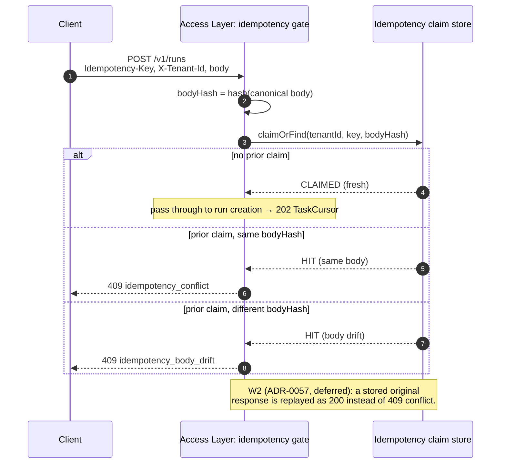

# `run-http-contract` — Process View (idempotency body-lifetime)

> **Migrated body-lifetime home (active).** This file is the L2 detail sink for
> the **idempotency body-lifetime** of `POST /v1/runs` — the runtime sequence
> that decides `idempotency_conflict` vs `idempotency_body_drift` vs (W2) cached
> replay. The binding authority is ADR-0057 plus the `409` response semantics of
> `createRun` (fact `contract-op/createrun`) in
> [`../../../../docs/contracts/openapi-v1.yaml`](../../../../docs/contracts/openapi-v1.yaml).
> The L1 process view ([`../../L1/agent-service/process.md`](../../L1/agent-service/process.md)
> §P1) shows the same idempotency gate at structural altitude; this sink carries
> its wire-level expansion. Nothing below mints a new status code or error code
> — each is cited from the OpenAPI source / ADR-0057.

## 1. Body-lifetime states (W1 claim-only)

The `Idempotency-Key` header binds a `(tenantId, key, bodyHash)` triple. W1 is
**claim-only** per ADR-0057: the platform records the claim but does NOT yet
store the original response for replay (that is the W2 extension).

| Observed request | Prior claim state | Outcome | Status / `error.code` |
|---|---|---|---|
| First use of `key` | none | claim recorded; run created | `202` `TaskCursor` |
| Reuse of `key`, identical body | claimed, same `bodyHash` | duplicate of an in-flight / completed claim | `409` `idempotency_conflict` |
| Reuse of `key`, different body | claimed, different `bodyHash` | body drift on a reused key | `409` `idempotency_body_drift` |
| Reuse of `key`, identical body (W2) | claimed + response stored | original response replayed | `200` cached response *(W2 — ADR-0057, deferred)* |

## 2. Sequence — claim / conflict / drift

## 3. Body-hash discipline

- The hash is taken over the **canonical** request body (the `CreateRunRequest`
  JSON), so semantically identical bodies hash identically and a re-ordered or
  reformatted body is not treated as drift.
- The claim is scoped by `tenantId` first (tenant isolation), so the same
  `Idempotency-Key` value used by two tenants never collides.
- The claim is recorded **before** any run state write, so a retry of a request
  that already created a run cannot create a second run.

## 4. Cross-references

- Wire contract (status matrix, request / response shapes):
  [`logical.md`](logical.md) §4.
- Structural parent sequence (L1 altitude):
  [`../../L1/agent-service/process.md`](../../L1/agent-service/process.md) §P1
  (the `Idempotency hit` / `fresh request` branch).
- Idempotency binding feature (L1):
  [`../../L1/agent-service/features/access-layer.md`](../../L1/agent-service/features/access-layer.md)
  (AS-L1-F05 tenant / auth / idempotency binding).
- Binding authority: ADR-0057 + `createRun` `409` semantics in
  [`../../../../docs/contracts/openapi-v1.yaml`](../../../../docs/contracts/openapi-v1.yaml).
- Sink index: [`README.md`](README.md).
