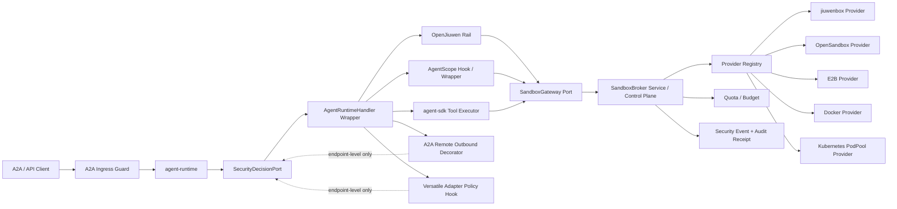

# Agent Runtime Sandbox Governance L2 Proposal

> **Date:** 2026-06-14
> **Baseline:** `origin/main` at `29d421c6` plus the companion security decision-chain proposals listed above.
> **Scope:** sandbox governance, broker/provider boundary, runtime adapter touchpoints, resilience profiles, and verification.
> **Non-goal:** this proposal does not redesign `agent-runtime`, `AgentRuntimeHandler`, OpenJiuwen, AgentScope, A2A, or Versatile. It defines sandbox-related capabilities under the current repository architecture.

## 1. Executive Summary

The current mainline is converging on a runtime that owns cross-framework invocation while delegating execution to framework-native adapters and external systems:

- OpenJiuwen and AgentScope remain native execution frameworks.
- A2A is the only northbound protocol exposed by runtime; blocking, SSE, and async task query are A2A method choices.
- A2A remote agents are discovered through Agent Cards and exposed as runtime-managed tool specs.
- Remote Agent orchestration is static-YAML driven, single-layer, and currently installed into OpenJiuwen as the caller-side tool path.
- Versatile Adapter maps A2A message text and metadata into REST/SSE workflow calls.
- Middleware services are currently memory/state abstractions; sandbox must be a governed execution capability, not a generic middleware shortcut.
- `INPUT_REQUIRED` now has multiple transport meanings: remote A2A continuation, Versatile workflow continuation, and possible future security approval.

Sandbox integration must follow that shape. The sandbox layer should be a governed capability path, not a new agent runtime framework and not a provider SDK inside `agent-runtime`.

The target design is:

```text
trusted ingress / AgentExecutionContext
  -> SecurityDecisionPort
  -> SandboxGateway port in agent-runtime
  -> SandboxBroker in agent-service or deployer control plane
  -> SandboxProvider plugin
  -> jiuwenbox / OpenSandbox / E2B / Docker / Kubernetes pool
```

The most important shift from earlier sandbox drafts is that sandbox is no longer only an isolation provider. It is part of the repository-owned security decision chain:

- `SecurityDecisionPort` decides whether a sandbox is required, forbidden, optional, or blocked.
- `capability-permissions.yaml` scopes sandbox profiles, provider classes, network, file transfer, and fallback.
- approval/audit contracts decide when sandbox execution must be parked, redacted, audited, or denied.
- A2A remote tools and Versatile workflows are not assumed to be deeply sandboxed just because they are remote.

## 2. Current Repo Alignment

This proposal uses only current `origin/main` architecture as authority:

| Current surface | Sandbox interpretation |
|---|---|
| A2A protocol design | Do not add a second northbound sandbox protocol to runtime. Sandbox state is surfaced through existing A2A task/result/error semantics. |
| `AgentRuntimeHandler` | Keep the narrow handler contract. Sandbox is attached through wrapper/adapters and `SandboxGateway`, not by changing handler semantics. |
| `AgentRuntimeHandler.start/stop/cancel(taskId)` | Wrapper may open/close gateway resources and map cancel to sandbox execution cancel. |
| Single-handler routing | Runtime currently selects one handler per deployment. Sandbox policy should be per runtime deployment/handler, not a hidden multi-agent router. |
| `agent-runtime` module metadata | Runtime defines ports and neutral DTOs only. It must not depend on `agent-service` or concrete provider SDKs. |
| Middleware services design | Memory/state remain middleware SPI. Sandbox uses a separate gateway/broker path because it manages isolation, provider health, quota, and audit. |
| OpenJiuwen adapter | Use OpenJiuwen-local rail/hook for pre-action tool/code/file/network interception when available. |
| AgentScope adapter family | Use AgentScope-native SDK/Harness hooks or adapter wrapper; if no pre-action hook exists, only whole-run gating is truthful. Current remote-tool caller support is not equivalent to OpenJiuwen. |
| A2A remote agent invocation | Decorate `RemoteAgentInvocationService` / `A2aRemoteAgentOutboundAdapter`; do not claim control over remote internals. |
| Remote Agent Card tool catalog | Treat discovered skills/tool specs as metadata requiring catalog admission, not as trusted authorization. Static YAML, card cache, timeout, and nested-call limits remain owned by remote orchestration. |
| Versatile Adapter | Enforce endpoint/header/query/input/result-extraction policy before REST/SSE calls; do not claim deep sandbox inside the remote workflow. |
| `TrajectoryEvent` | Operational telemetry. Security decisions and audit receipts remain paired security events or audit refs. |

## 3. Root Cause / Strongest Interpretation (Rule D-1)

1. **Observed failure / motivation:** high-risk tool/code/file/network execution can occur through local framework tools, SDK tools, A2A remote tools, or Versatile workflow calls, but those paths do not yet share one sandbox governance, provider, and audit boundary.
2. **Execution path:** `A2aJsonRpcController -> A2aAgentExecutor -> AgentRuntimeHandler wrapper / OpenJiuwen rail / AgentScope hook / SDK tool executor / A2A outbound decorator / Versatile adapter -> SecurityDecisionPort -> SandboxGateway -> SandboxBroker -> SandboxProvider`.
3. **Root cause:** previous drafts treated sandbox primarily as runtime middleware. Current mainline requires sandbox to become a security-chain-controlled capability that respects tenant trust, remote-tool catalog admission, Versatile metadata/body rules, and approval/audit redaction.
4. **Evidence:** current mainline includes the refreshed L2 runtime documents, A2A-only northbound endpoints, single-handler deployment guidance, tenant propagation without authentication, static remote-agent YAML/card cache, OpenJiuwen remote-tool installation, Versatile text-as-body mapping, metadata/header forwarding, result extraction, `connection_closed -> INPUT_REQUIRED` behavior, and security proposal companion contracts for permission, decision, approval, and audit.

## 4. Design Principles

1. **Runtime owns the port, not the provider.** `agent-runtime` defines `SandboxGateway` and neutral DTOs. Provider clients live in `agent-service`, deployer infrastructure, or optional provider modules.
2. **Security decision comes first.** Sandbox acquire/execute is never the first policy check. It follows `SecurityDecisionPort` and carries `decisionId`, `securityEvaluationRequestId`, `delegationEnvelopeRef`, and `auditRef` when required.
3. **Sandbox is not authorization.** Sandbox isolation reduces impact after a decision, but it does not replace tenant auth, capability permission, approval, or audit.
4. **No invisible deep sandbox claim.** Remote A2A, Versatile, remote AgentScope, and external LangGraph-style runtimes get endpoint-level policy only unless a certified remote sandbox receipt is returned.
5. **Fail closed in research/prod.** Local fallback is dev-only, explicit, low-risk, and auditable as `no-real-isolation`.
6. **Provider capability is explicit.** jiuwenbox, OpenSandbox, E2B, Docker, and Kubernetes pools expose different isolation, lifecycle, file, stream, network, and snapshot capabilities. Broker routing must inspect those capabilities.
7. **Audit refs over payloads.** stdout, stderr, file content, API bodies, tool arguments, and result snippets are redacted, hashed, or referenced by artifact refs.
8. **Respect existing L2 feature scopes.** A2A protocol, heterogeneous adapters, remote orchestration, memory/state middleware, trajectory observability, and Versatile mapping keep their current responsibilities; sandbox only adds the sandbox governance path and required hooks.

## 5. Logical Architecture



Key boundaries:

- Runtime adapters only request sandbox operations through `SandboxGateway`.
- Broker owns routing, policy confirmation, quota, retry, failover, pool choice, and provider health.
- Provider plugins own concrete API mapping and capability reporting.
- Security events and audit receipts are emitted by broker/service and referenced by runtime.

## 6. Sandbox Surfaces

| Surface | Sandbox behavior | Boundary |
|---|---|---|
| Whole-run handler wrapper | Acquire workspace lease before `execute`; release on terminal state; cancel active execution on `cancel(taskId)` | Good for workspace and coarse isolation, not tool-level enforcement |
| OpenJiuwen local rail | Intercept pre-action tool/code/file/network calls and map them to sandbox execution | Enforce only when the rail is pre-action and blocking |
| AgentScope local hook | Use SDK/Harness hook or adapter wrapper for high-risk tool/code/file/network calls | If hook is post-action only, high-risk paths must be denied or proxied; do not assume OpenJiuwen remote-tool semantics |
| agent-sdk tool executor | Wrap `http:` and future high-risk tools with security decision and optional sandbox execution | Direct network/file/process calls must not bypass policy |
| A2A remote outbound | Enforce endpoint/capability/tenant/fallback policy; optionally require certified remote sandbox evidence | Does not control remote internal tools; respects static YAML, timeout, cancel, and no-nested-call behavior |
| Remote Agent Card catalog | Admit generated remote tools before exposing them to a caller adapter | Card skills are prompt/tool metadata, not trust; current mainline caller-side installation is OpenJiuwen-oriented |
| Versatile workflow | Enforce URL template, query, header, input, result extraction, timeout, continuation namespace | Does not sandbox remote internal workflow execution |

## 7. Runtime Port Contract

### 7.1 SandboxGateway

```java
public interface SandboxGateway {
    CompletionStage<SandboxLease> acquire(SandboxAcquireRequest request);
    CompletionStage<SandboxExecution> execute(SandboxExecutionRequest request);
    Flow.Publisher<SandboxExecutionEvent> stream(SandboxExecutionRef executionRef);
    CompletionStage<SandboxFileRef> putFile(SandboxFilePutRequest request);
    CompletionStage<SandboxFileRef> getFile(SandboxFileGetRequest request);
    CompletionStage<SandboxCancelResult> cancel(SandboxExecutionRef executionRef, SandboxCancelReason reason);
    CompletionStage<SandboxReleaseResult> release(SandboxLeaseRef leaseRef, SandboxReleaseReason reason);
}
```

Runtime rules:

- all calls carry deadline and idempotency key;
- no provider SDK types cross this interface;
- blocking provider operations are hidden behind broker/provider threads or async clients;
- runtime maps sandbox results back to framework-native outputs, `INPUT_REQUIRED`, or typed failure.

### 7.2 SandboxAcquireRequest

Mandatory core:

```yaml
schemaVersion: sandbox-gateway/v1
requestId: sbx_req_01
idempotencyKey: tenant/session/task/action/hash
tenantId: tenant-a
userId: user-a
sessionId: session-a
taskId: task-a
agentId: agent-a
sourceSurface: openjiuwen_rail | agentscope_hook | sdk_tool | a2a_outbound | versatile_adapter | handler_wrapper
capabilityKind: SANDBOX
actionType: SANDBOX_ACQUIRE | SANDBOX_EXEC
securityDecisionRef:
  decisionId: decision_01
  securityEvaluationRequestId: sec_eval_01
  delegationEnvelopeRef: delegation_01
riskTier: R0_PURE_REASONING | R1_LOCAL_READ | R2_NETWORK_READ | R3_STATE_WRITE | R4_CODE_OR_SYSTEM_EXEC | R5_BUSINESS_CRITICAL
trustTier: trusted | reviewed | untrusted
dataClass: public | internal | customer | credential | regulated
sandboxPurpose: code_exec | tool_exec | file_transform | browser | remote_certified | workspace
```

Hints and policy:

```yaml
templateRef: python-3.11-tools
resourceClass: small | medium | large | gpu
networkProfile: none | allowlist | internet | private_network
filesystemProfile: read_only | workspace_rw | artifact_only
providerPreference: jiuwenbox | opensandbox | e2b | docker | k8s
latencyClass: interactive | batch | background
coldStartPolicy: warm_only | allow_warm | allow_cold
fallbackPolicy: deny | retry_same_provider | new_sandbox_same_provider | certified_equivalent_provider | dev_local_only
approvalRef: approval_01
auditRef: audit_01
redactedPreviewRef: payload_ref://...
```

Providers may ignore hints that they cannot support, but the broker must not ignore mandatory policy fields.

## 8. Broker and Provider Contracts

### 8.1 SandboxBroker API

Broker responsibilities:

- validate tenant/user/session/task trust context;
- re-check policy version and sandbox scope;
- reserve quota before provider allocation;
- route to a provider by capability, health, cost, latency, and profile;
- create or lease a sandbox;
- stream execution events;
- emit security events and audit refs;
- release, quarantine, or destroy resources.

REST shape:

```http
POST /sandbox/v1/leases
POST /sandbox/v1/executions
GET  /sandbox/v1/executions/{executionId}/events
POST /sandbox/v1/executions/{executionId}:cancel
PUT  /sandbox/v1/leases/{leaseId}/files/{path}
GET  /sandbox/v1/leases/{leaseId}/files/{path}
POST /sandbox/v1/leases/{leaseId}:release
GET  /sandbox/v1/providers/{providerId}/health
GET  /sandbox/v1/pools
```

In-process dev mode may implement `SandboxGateway` directly. Research/prod should prefer out-of-process broker or a clearly separated service component.

### 8.2 Provider SPI

```java
public interface SandboxProvider {
    SandboxProviderDescriptor descriptor();
    CompletionStage<SandboxProvisionResult> provision(SandboxProvisionRequest request);
    CompletionStage<SandboxExecutionResult> execute(SandboxProviderExecutionRequest request);
    Flow.Publisher<SandboxExecutionEvent> stream(SandboxProviderExecutionRef executionRef);
    CompletionStage<SandboxTransferResult> transfer(SandboxTransferRequest request);
    CompletionStage<SandboxCancelResult> cancel(SandboxProviderExecutionRef executionRef);
    CompletionStage<SandboxReleaseResult> release(SandboxProviderLeaseRef leaseRef);
    CompletionStage<SandboxDestroyResult> destroy(SandboxProviderLeaseRef leaseRef);
    SandboxProviderHealthSnapshot healthSnapshot();
}
```

Provider descriptor:

```yaml
providerId: opensandbox-prod
apiVersion: provider/opensandbox/v1
isolation: process | container | microvm | k8s_runtimeclass
supports:
  exec: true
  streaming: true
  files: true
  snapshot: true
  networkPolicy: true
  warmPool: true
  cancel: true
  quotaSignals: true
certification:
  level: none | internal-reviewed | certified-equivalent
  profiles: ["restricted-code", "regulated-no-network"]
  expiresAt: 2026-12-31
```

## 9. Provider Adaptation

| Provider | Best use | Required adapter behavior |
|---|---|---|
| jiuwenbox | local/openJiuwen ecosystem, dev/research, low-cost container execution | expose lifecycle/exec/file/stream as provider SPI; do not claim HA or microVM isolation unless implemented |
| OpenSandbox | cloud/control-plane style sandbox, async lifecycle, metrics, snapshot, egress policy | map lifecycle service, execd, file/artifact, metrics, egress, and snapshot to provider SPI |
| E2B | hosted microVM-style agent code execution | wrap HTTP/API or SDK outside runtime; mark SaaS cost, API key, data residency, and network policy limits |
| Docker | local development and controlled research | prod disabled by default; Docker socket risk must be documented; never mark as microVM |
| Kubernetes PodPool | managed warm pools, namespace policy, RuntimeClass, ResourceQuota, NetworkPolicy | implement pool template, lazy pool materialization, HPA/KEDA metrics, cleanup, and quarantine |

Open-source borrowing rule:

- adapters may borrow API ideas from jiuwenbox, OpenSandbox, E2B, OpenClaw/Codex-like sandbox mechanisms, Docker/Kubernetes clients;
- copied code or API-compatible behavior must record source, version, license, and delta;
- provider-specific semantics stay behind provider SPI.

## 10. Security Decision Chain Integration

Sandbox proposal depends on the companion security proposals:

| Security proposal object | Sandbox use |
|---|---|
| `SecurityEvaluationRequest` | created before sandbox acquire/execute when a high-risk action is planned |
| `SecurityDecision` | returns `ALLOW`, `DENY`, `ROUTE_TO_SANDBOX`, `SUSPEND_FOR_APPROVAL`, or obligations |
| `CapabilityKind.SANDBOX` | describes sandbox acquire/execute/file-transfer capabilities |
| `SandboxScope` | constrains provider, network, filesystem transfer, template, isolation, resource class |
| `DecisionObligation.REQUIRE_AUDIT_RECEIPT` | blocks R4/R5 execution until audit reserve succeeds |
| `SecurityDecisionEvent` | records route, degradation, approval, redaction, and sandbox outcome |
| `DelegationEnvelope` | prevents HITL or sandbox selection from expanding least-agency scope |

Sandbox-specific rules:

- sandbox cannot be used to bypass denied capability policy;
- sandbox local fallback cannot be chosen by framework adapters;
- provider failover must be policy-equivalent or certified-equivalent in regulated profiles;
- remote sandbox evidence from A2A/Versatile is treated as evidence only unless certified and scoped.

## 11. Tenant and Trust Preconditions

The P0 tenant/auth issue is a precondition for production sandbox correctness.

| Mode | Tenant source | Sandbox behavior |
|---|---|---|
| `single-tenant-dev` | configured default tenant allowed | fake/local provider allowed with warning and `no-real-isolation` audit marker |
| `trusted-gateway` | gateway-authenticated and stripped/re-injected tenant headers | broker accepts tenant only from trusted transport context |
| `authenticated` | verified token/claims mapped to tenant/user/roles | required for multi-tenant research/prod |

Research/prod sandbox acquire must fail closed when tenant/user/session/task cannot be trusted. A sandbox lease is tenant-scoped. Artifact refs, payload refs, quota reservations, and provider resources must not be resolvable across tenants.

Current A2A design propagates `X-Tenant-Id` but does not authenticate it. Therefore:

- a standalone runtime without trusted ingress can only claim `single-tenant-dev` sandbox behavior;
- a research/prod deployment must receive tenant/user/session/task identity from a trusted gateway or verified claims;
- the broker rejects mismatched tenant context even if a framework adapter, Agent Card, Versatile metadata, or model output supplies a different tenant value.

## 12. Continuation and `INPUT_REQUIRED`

Sandbox execution can be long-running or waiting for external input, but it must not collide with remote-agent or approval semantics.

| Waiting state | Namespace | Resume authority |
|---|---|---|
| sandbox execution waiting | `sandbox.waitingTarget=execution` | `executionId`, `leaseId`, broker state |
| remote A2A continuation | `runtime.waitingTarget=remote_agent` | remote task/context/tool metadata |
| Versatile workflow continuation | `runtime.waitingTarget=versatile_workflow` | workflow/conversation metadata |
| security approval | `security.waitingTarget=approval` | `approvalRef`, `decisionId`, approval record |

Resume attempts must be rejected if the namespace is absent, supplied only by model/tool output, stale, or mismatched to the stored broker state.

Sandbox continuation is projected through existing A2A task semantics rather than a new northbound endpoint. Runtime may return `INPUT_REQUIRED`, `FAILED`, or a typed sandbox-unavailable error, but the resume authority remains in broker/task state, not in model-visible text or untrusted metadata.

## 13. Resilience Profiles

| Profile | Product shape | Reliability expectation | Cost |
|---|---|---|---|
| `SBX-0 dev-fake` | No real isolation, fake/local process provider | unit tests and local development only | minimal |
| `SBX-1 local-container` | jiuwenbox or Docker-style local provider | single-node, best-effort cleanup | low |
| `SBX-2 managed-pool` | OpenSandbox/E2B/K8s single-region pool | health checks, warm pool, retry/new sandbox | medium |
| `SBX-3 enterprise-ha` | multi-provider or multi-zone managed pool | circuit breaker, certified-equivalent failover, audit recovery | high |
| `SBX-4 regulated-strict` | certified providers only, strict egress/no local fallback | fail closed on policy/audit/provider uncertainty | highest |

Deployment chooses a profile. Runtime adapters do not independently downgrade reliability or safety.

## 14. Failure, Retry, and Fallback

Broker-owned policy:

| Failure | Broker action | Runtime/framework result |
|---|---|---|
| provider health degraded before lease | route to eligible provider or queue | no framework-local decision |
| acquire timeout | retry by idempotency key or route to equivalent provider | typed sandbox unavailable |
| execution process crash | classify retryability; optionally create new sandbox and replay only idempotent command | typed retryable/non-retryable failure |
| container/pod lost | quarantine lease, preserve artifact refs if possible | typed failure with auditRef |
| audit reserve unavailable for R4/R5 | deny before execution | high-risk side effect blocked |
| redaction unavailable and payload retention required | suspend or deny by profile | no raw payload persisted |
| local fallback requested in research/prod | deny | `LOCAL_FALLBACK_FORBIDDEN` |

Local fallback is allowed only when all are true:

- posture is `dev`;
- risk is R0/R1;
- no credential/customer/regulated data;
- no file write outside temp workspace;
- no private network or privileged execution;
- `allow-local-fallback=true`;
- audit marks `no-real-isolation`.

## 15. Performance and Latency

Sandbox adds latency. Optimization is allowed only inside the selected security profile:

- warm pools by `PoolTemplate`;
- snapshot/resume when provider supports it;
- connection reuse between gateway and broker;
- streaming execution events instead of polling;
- artifact refs instead of large inline payload transfer;
- prewarm hints from planned tool/capability graph;
- keep lease for a bounded session when contamination/reset policy allows;
- async execution refs for long-running tasks.

Latency fields:

```yaml
latencyClass: interactive | batch | background
prewarmHint: none | likely | required
maxAcquireLatencyMs: 800
maxFirstOutputLatencyMs: 1500
```

Safety wins over latency. A warm sandbox cannot be reused if tenant, trust tier, template, data class, network profile, or taint policy is incompatible.

## 16. Kubernetes Pool Model

Kubernetes is a provider/control-plane capability, not a runtime dependency.

Pool template:

```yaml
poolTemplateId: tenant-trust-template
tenantScope: tenant | shared-dev | dedicated-regulated
trustTier: trusted | reviewed | untrusted
templateRef: python-3.11-tools
runtimeClass: kata | gvisor | runc
resourceClass: small
networkProfile: none | allowlist
minWarm: 2
maxWarm: 20
scaleMetric: queueDepth + acquireLatency + warmDeficit
```

K8s mapping:

- Namespace or labels for tenant/scope.
- RuntimeClass for isolation.
- NetworkPolicy for egress.
- ResourceQuota and LimitRange for resource bounds.
- Pod security admission for privilege control.
- TTL/cleanup controller for stale sandboxes.
- KEDA/HPA based on warm deficit and queue depth.
- Quarantine label for failed/tainted pods.

Pool dimensions must be lazily materialized. Do not create a full Cartesian product for every tenant/trust/template/network/resource combination.

## 17. Data Residency and Audit

Security/audit events store:

- tenant/session/task/agent ids;
- decision/audit/approval refs;
- provider id and capability descriptor;
- lease/execution ids;
- hashes and redaction summaries;
- artifact refs and retention policy;
- failure code and fallback decision.

Security/audit events do not store by default:

- raw prompt;
- raw tool args/results;
- raw file content;
- raw API/MCP/A2A payload;
- sandbox stdout/stderr;
- secrets, cookies, tokens, env values.

Raw evidence, if required by regulated workflow, must be in a separate encrypted evidence store with tenant/session/task ACL, short TTL, break-glass audit, and deletion policy.

## 18. Configuration

Example:

```yaml
agent-runtime:
  sandbox:
    enabled: true
    posture: research
    trust:
      source: trusted-gateway        # single-tenant-dev | trusted-gateway | authenticated
      failClosedProfiles: [research, prod]
    gateway:
      mode: remote-broker
      endpoint: https://sandbox-broker.internal
      timeout: 2s
    default-profile: SBX-2
    local-fallback:
      enabled: false

agent-service:
  sandbox:
    broker:
      providers:
        - id: opensandbox-prod
          kind: opensandbox
          profile: SBX-2
        - id: k8s-kata-pool
          kind: k8s-pool
          profile: SBX-3
      retry:
        acquireAttempts: 2
        providerFailover: certified-equivalent
      quota:
        reservationTtl: 30s
      audit:
        requireReserveBeforeR4: true
```

## 19. Modules To Develop

| Module / artefact | Responsibility |
|---|---|
| `SandboxGateway` port | runtime-side neutral sandbox contract |
| `SandboxHandlerWrapper` | whole-run acquire/release/cancel wrapper |
| `SandboxTenantTrustContextResolver` | map trusted ingress/runtime identity into broker-safe tenant/user/session/task context |
| `SandboxA2aTaskProjector` | map sandbox wait/fail/cancel states into existing A2A task semantics |
| `OpenJiuwenSandboxRail` | local OpenJiuwen pre-action tool/code/file/network interception |
| `AgentScopeSandboxHook` | AgentScope SDK/Harness sandbox hook or wrapper |
| `SdkToolSandboxGuard` | guard `http:` and future high-risk SDK tools |
| `A2aRemoteSandboxPolicyDecorator` | endpoint-level sandbox policy and certified evidence handling |
| `VersatileSandboxPolicyHook` | endpoint/header/query/input/result-extraction policy hook |
| `SandboxBrokerService` | lease, routing, quota, health, audit, retry, failover |
| `SandboxProvider` SPI | provider abstraction |
| `sandbox-provider-jiuwenbox` | jiuwenbox adapter |
| `sandbox-provider-opensandbox` | OpenSandbox adapter |
| `sandbox-provider-e2b` | E2B adapter |
| `sandbox-provider-docker` | dev/local Docker adapter with explicit risk marking |
| `sandbox-provider-k8s-pool` | Kubernetes warm pool adapter |
| `sandbox-gateway.v1.yaml` | request/response contract |
| `sandbox-provider.v1.yaml` | provider descriptor and health contract |
| `sandbox-event.v1.yaml` | sandbox security/control-plane event contract |

## 20. Verification Plan

Contract tests:

- `SandboxGatewaySchemaTest`: validates v1 request/response required fields.
- `SandboxProviderDescriptorTest`: provider capabilities cannot overclaim isolation.
- `SandboxDecisionRefRequiredTest`: research/prod acquire requires security decision refs.
- `SandboxTenantTrustFailClosedTest`: missing/untrusted tenant blocks acquire.
- `SandboxA2aProjectionContractTest`: sandbox waiting/failure/cancel states map to valid A2A task states without adding a new northbound protocol.

Runtime tests:

- `SandboxHandlerWrapperLifecycleTest`: start/stop/cancel delegates and releases resources.
- `OpenJiuwenSandboxRailPreActionTest`: high-risk tool is blocked before execution.
- `AgentScopeSandboxHookCoverageTest`: unsupported post-action-only hooks cannot claim R4/R5 enforcement.
- `SingleHandlerSandboxPolicyTest`: sandbox policy is bound to the selected runtime handler/deployment, not a hidden multi-handler router.
- `SdkToolSandboxGuardTest`: HTTP/file/process tool paths are routed or denied by policy.
- `A2aRemoteSandboxEvidenceTest`: remote sandbox claims are evidence only unless certified.
- `RemoteToolStaticCatalogPolicyTest`: static YAML/card-cache remote tools require catalog admission before exposure.
- `VersatileSandboxPolicyHookTest`: header/query/input/result extraction policy is enforced before REST call.
- `InputRequiredNamespaceSandboxTest`: sandbox wait state cannot resume remote or approval state.

Broker/provider tests:

- `SandboxQuotaReservationLifecycleTest`: reserve, commit, release, expiry, and rollback.
- `SandboxProviderFailoverTest`: provider crash routes only to equivalent provider.
- `SandboxLocalFallbackPolicyTest`: prod local fallback is denied.
- `SandboxK8sPoolScaleTest`: queue depth and warm deficit drive desired warm count.
- `SandboxAuditRedactionTest`: stdout/stderr/file/API payloads are redacted or referenced, not stored inline.

E2E tests:

- local fake provider dev flow;
- jiuwenbox/OpenJiuwen high-risk tool flow;
- OpenSandbox or K8s pool execution flow;
- A2A parent calling remote agent where remote internal sandbox is not trusted as local proof;
- Versatile workflow call with scoped metadata and redacted audit.

## 21. Rollout

1. **Wave 0:** add contracts and design-only schema; no runtime behavior change.
2. **Wave 1:** add `SandboxGateway` and fake/local dev implementation with fail-closed posture defaults.
3. **Wave 2:** add `SecurityDecisionPort` integration and SDK/OpenJiuwen local guards.
4. **Wave 3:** add broker service, quota, audit refs, provider SPI, and one real provider.
5. **Wave 4:** add OpenSandbox/E2B/K8s providers, warm pool, health, failover, and event contracts.
6. **Wave 5:** add certified-equivalent provider conformance, regulated profile, and redaction/evidence store integration.

## 22. Alternatives

| Alternative | Why rejected |
|---|---|
| Put E2B/OpenSandbox/jiuwenbox SDKs directly in `agent-runtime` | Violates runtime neutrality and module direction. |
| Let every framework call its own sandbox directly | Produces inconsistent policy, quota, audit, fallback, and tenant behavior. |
| Treat remote runtime sandbox claims as sufficient proof | Remote claims are not locally enforceable unless certified and scoped. |
| Use sandbox as the only safety control | Sandbox does not solve tenant spoofing, approval, secrets, memory poisoning, or audit. |
| Allow local fallback for sandbox outage in prod | Breaks fail-closed posture and least-agency boundary. |

## 23. Self-Audit

| Risk | Severity | Mitigation |
|---|---|---|
| Proposal spans many provider types | P1 | Keep runtime contract small; move provider specifics behind SPI and conformance tests. |
| Remote A2A/Versatile may be mistaken for deep sandbox | P0 | Explicit endpoint-only boundary and certified evidence rule. |
| Sandbox adds latency | P1 | Warm pools, snapshot, streaming, artifact refs, but no safety downgrade. |
| Provider capability overclaim | P1 | Provider descriptor tests and regulated certified-equivalence gates. |
| Audit may leak interaction data | P0 | Redaction-before-persist, hashes, refs, regulated evidence store only. |

## Authority

- Latest mainline runtime shape: `origin/main` at `29d421c6`.
- Companion security decision chain proposals define policy, decision, approval, audit, and least-agency boundaries.
- Earlier sandbox proposals remain useful background, but this document is the current L2 sandbox governance proposal.
