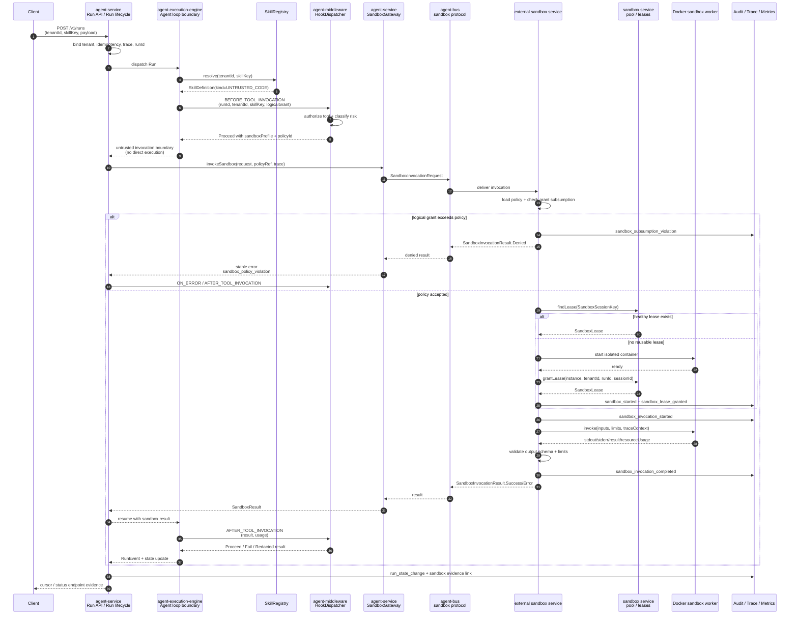
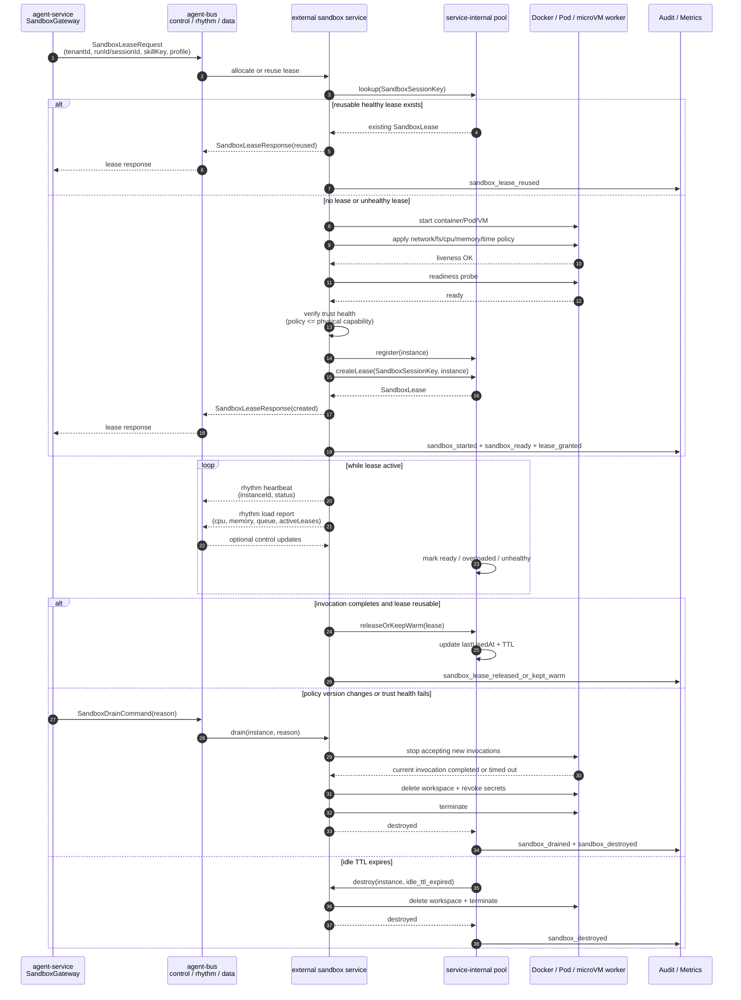
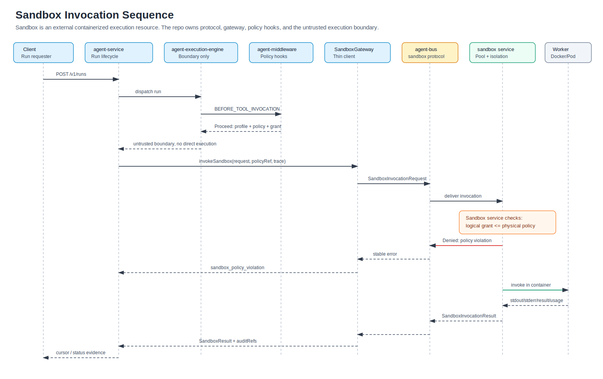
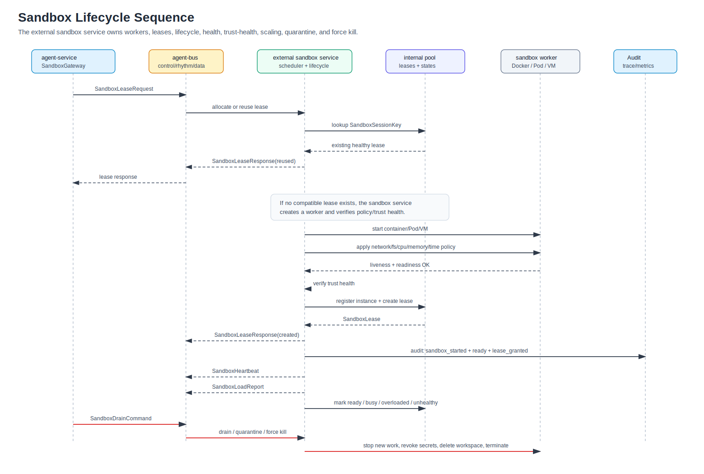

# Containerized Sandbox Service Design Review

## Executive Summary

The repository already recognizes sandbox execution as a trustworthy architecture concern, but sandbox should not become a standalone L1 module, should not become `agent-middleware`, and should not be embedded inside `agent-execution-engine` or a heavy `agent-service` runtime manager.

The latest placement direction is to model sandbox execution as a **containerized external execution resource** in the microservice deployment topology. In repository terms, the existing modules only own contracts and integration points:

- `agent-bus` owns the cross-service sandbox protocol and event contracts.
- `agent-service` owns a thin `SandboxGateway` / client adapter, posture boot guard, Run-state integration, audit, and trace glue.
- `agent-middleware` owns policy interception, authorization, routing metadata, result filtering, and failure normalization.
- `agent-execution-engine` owns the untrusted execution boundary rule: it must not directly execute `UNTRUSTED_TOOL` or `UNTRUSTED_CODE`.
- the real sandbox worker, pool, provider, lifecycle manager, and isolation runtime live as an external Docker/Kubernetes/microVM execution service.

Existing assets include:

- `SkillKind.UNTRUSTED_TOOL` and `SkillKind.UNTRUSTED_CODE` in the unified Skill SPI.
- `docs/contracts/skill-definition.v1.yaml` with `sandbox_routing`.
- `docs/governance/sandbox-policies.yaml` as the sandbox policy source of truth.
- `agent-middleware` hook points for tool invocation, memory access, error handling, and policy insertion.
- architectural references that already treat runtime-to-tools/sandbox as a sensitive boundary.
- Trust boundary documentation that treats runtime-to-tools/sandbox as a `runtime_extension` boundary.

What is missing is the runtime execution plane:

- no concrete sandbox protocol and `SandboxGateway` path in active source;
- no sandbox pool or lease model;
- no sandbox health/readiness/trust-health monitoring;
- no sandbox load model;
- no session affinity model;
- no scale-out or replacement behavior;
- no runtime policy subsumption check;
- no production refusal path for over-wide grants;
- no containerized sandbox-service reference scenario proving that untrusted skill execution is isolated, auditable, recoverable, and operable.

The recommended direction is therefore:

- do not create an independent sandbox L1 or seventh capability-services module;
- do not turn `agent-middleware` into a sandbox manager;
- do not place sandbox pool, lease, lifecycle, or container management inside `agent-execution-engine`;
- place cross-service sandbox protocol contracts in `agent-bus`;
- keep `agent-service` thin: `SandboxGateway`, boot guard, Run/audit/trace integration, and stable failure mapping;
- keep `agent-middleware` as the hook layer for policy decisions, authorization, routing metadata, result redaction, and failure normalization;
- run the actual sandbox manager/worker as a containerized external execution service.

In short: sandbox is an external execution resource in the microservice topology. The codebase should define how the agent runtime calls it, observes it, and fails closed around it; the codebase should not make the sandbox worker a middleware or execution-engine implementation detail.

## Conformance to Latest Placement Decision

This review has been refreshed against the latest repository-owner feedback: "put it in the microservice system" means a containerized sandbox execution service / external execution resource, not a heavy in-process `agent-service` manager.

Conformance assessment:

| Question | Answer |
|---|---|
| Does this document propose a new L1 module? | No. It explicitly rejects standalone sandbox L1/module treatment. |
| Primary runtime owner for sandbox execution? | External containerized sandbox service / execution resource. |
| Primary repository home for cross-service sandbox contracts? | `agent-bus`, under a sandbox protocol package. |
| Role of `agent-middleware`? | Policy interception, authorization, routing metadata, result filtering, and error normalization only. |
| Role of `agent-service`? | Thin `SandboxGateway` client, posture boot guard, Run/audit/trace integration. |
| Role of `agent-execution-engine`? | Untrusted execution boundary: never directly execute untrusted skills. |
| Role of `agent-bus`? | Sandbox invocation protocol, lease events, heartbeat, load, drain, cancel, and cross-plane coordination. |
| Physical isolation location? | Docker container first; later Kubernetes Pod or microVM. |

Earlier wording was easy to misread as a module-local sandbox capability. The intended claim boundary is now: sandbox is a microservice deployment resource, with repository-owned contracts and integration points distributed across the existing modules.

## Current Repository Reading

### Current Strengths

The codebase already has several good architectural decisions:

1. Skill kinds are closed and explicit.
   `UNTRUSTED_TOOL` and `UNTRUSTED_CODE` are type-level discriminators, which is better than relying on string metadata or convention.

2. Sandbox policy exists as a governance artifact.
   `docs/governance/sandbox-policies.yaml` declares default-deny behavior and required limit dimensions: outbound network, filesystem read, filesystem write, CPU cap, memory cap, and wall-clock cap.

3. Middleware already has the right hook shape.
   `BEFORE_TOOL_INVOCATION`, `AFTER_TOOL_INVOCATION`, and `ON_ERROR` are natural enforcement points for tool authorization, sandbox routing decisions, result filtering, and failure normalization.

4. The design already rejects a seventh "capability services" module.
   This is healthy for the current reactor. Sandbox should be integrated through existing modules and deployed as an external containerized resource, rather than introduced as a new top-level Maven module or independent L1.

5. The trust-boundary corpus already names runtime-to-tools/sandbox as a sensitive boundary.
   This means future sandbox work can be reviewed as a trustworthy microservice-boundary increment rather than as an isolated implementation detail.

6. `agent-bus` is already the right home for cross-plane contracts.
   Its module metadata declares no downstream dependencies, and its L1 architecture already owns cross-plane control fabric and the control/data/rhythm channel split. Adding `bus.spi.sandbox` is consistent with that direction.

7. `agent-service` is already the right home for thin adapters.
   It may depend on `agent-bus`, `agent-middleware`, and `agent-execution-engine`, while the reverse direction is forbidden. A sandbox gateway in service can therefore compose Run state, audit, trace, posture, and bus protocol without making upstream modules depend on service.

### Current Gaps

The main gaps are runtime closure and operational design:

1. `sandbox-policies.yaml` is schema-shipped, not runtime-enforced.
   It describes target behavior, but runtime policy subsumption is still deferred.

2. The platform has no active sandbox lifecycle.
   There is no first-class model for creating, leasing, checking, scaling, draining, or destroying sandbox instances.

3. Middleware hook delivery is not enough.
   A hook can say "this call requires sandbox", but cross-service sandbox invocation must go through a stable gateway/protocol rather than in-process middleware logic.

4. No multi-sandbox scheduling model exists.
   There is no answer yet for session affinity, load balancing, tenant fairness, health-aware routing, or pool warm-up.

5. No audit-grade sandbox event model exists.
   Sandbox start, invocation, denial, timeout, OOM, policy violation, lease migration, and destroy events should become auditable runtime events.

6. No containerized sandbox-service reference scenario proves isolation.
   A trustworthy release should prove at least one untrusted skill can execute in a restricted container, fail closed on policy violations, and leave traceable evidence.

7. Existing authority documents still name the older `SandboxExecutor` placement.
   ADR-0103, ADR-0111, Rule R-L, P-L, `skill-definition.v1.yaml`, and `sandbox-policies.yaml` still refer to `SandboxExecutor` or engine-local enforcement. The latest design is reasonable, but it needs a superseding ADR and rule/contract cleanup before implementation.

### Governance Migration Required

This report is a design review, not yet an authority change. Before code implementation, the repository should add a superseding ADR that replaces the older `SandboxExecutor` placement with the external sandbox service model.

Required governance updates:

| Artifact | Current issue | Required update |
|---|---|---|
| `docs/adr/0103-rc22-agent-middleware-naming-and-capability-services-distribution.yaml` | Sandbox is assigned to `agent-execution-engine` / `SandboxExecutor`. | Keep the "no seventh module" decision, but change sandbox distribution to `agent-bus` protocol + `agent-service` gateway + external sandbox service. |
| `docs/adr/0111-sandbox-routing-vault-rotation-otlp-tenant-outbox-replay.yaml` | Startup gate checks active `SandboxExecutor`. | Change the gate to check `SandboxGateway` endpoint/configuration and sandbox-service availability posture. |
| `docs/governance/rules/rule-R-L.md` and `docs/governance/principles/P-L.md` | Runtime refusal is phrased as `SandboxExecutor` behavior. | Rephrase as sandbox-service subsumption enforcement through `SandboxGateway` / `bus.spi.sandbox` contracts. |
| `docs/contracts/skill-definition.v1.yaml` | `sandbox_routing.enforcer` names `SandboxExecutor SPI`. | Change enforcer to `SandboxGateway` + sandbox service protocol. |
| `docs/governance/sandbox-policies.yaml` | Comments say the file is consumed by `SandboxExecutor`. | Change consumer to sandbox service and gateway boot checks. |
| `docs/contracts/contract-catalog.md` and `agent-bus/module-metadata.yaml` | No sandbox protocol surface is declared. | Add `com.huawei.ascend.bus.spi.sandbox` and its contract status. |

Without this migration, a PR that implements the external-service model will conflict with accepted repository authority even though the design direction is sound.

## Target Architecture

### Responsibility Split

Recommended module ownership:

| Concern | Recommended Home | Rationale |
|---|---|---|
| Skill classification | `agent-middleware` Skill SPI | Skill kind is already part of the unified Skill model. |
| Sandbox cross-service protocol | `agent-bus` | Sandbox is a microservice/external execution resource, so request, result, lease, heartbeat, load, drain, and cancel contracts belong on the bus side. |
| Sandbox gateway/client | `agent-service` | `agent-service` owns Run lifecycle, trace, audit, posture, and boot checks, but should only call a gateway. |
| Untrusted execution boundary | `agent-execution-engine` | The engine must not directly execute untrusted skills; it should delegate through the service-owned sandbox gateway path. |
| Policy interception | `agent-middleware` | Middleware should authorize and enrich execution, not manage containers. |
| Pool, lifecycle, resource isolation, and worker implementation | external sandbox service | These are operational runtime responsibilities of the containerized sandbox service. |
| Policy source of truth | `docs/governance/sandbox-policies.yaml` | Keep policy-as-contract and promote it to runtime input. |
| Physical isolation | external sandbox runtime | Container, process, VM, microVM, or Kubernetes Pod should be external runtime resources. |

### Core Execution Flow

Recommended microservice flow:

```text
Run / Agent Loop
  -> SkillRegistry.resolve(tenantId, skillKey)
  -> inspect SkillKind
  -> RuntimeMiddleware BEFORE_TOOL_INVOCATION
  -> SandboxRoutingGuard
  -> agent-service SandboxGateway
  -> agent-bus sandbox protocol
  -> external sandbox service
  -> sandbox pool / worker / container
  -> SandboxResult
  -> RuntimeMiddleware AFTER_TOOL_INVOCATION
  -> RunEvent + audit + trace
```

Important boundary rule:

Middleware decides whether a call is allowed and what policy envelope applies. It should not create containers, maintain pools, own leases, execute untrusted code, or collect sandbox heartbeats. `agent-service` should also remain thin: it calls a gateway and records Run/audit/trace outcomes; it does not manage sandbox workers. Pool and lifecycle management belong inside the external sandbox service, with protocol and coordination events represented in `agent-bus`.

### Sandbox Invocation Sequence

The following sequence shows the recommended runtime path for one untrusted skill invocation.



Key design points:

- the engine never invokes `UNTRUSTED_TOOL` or `UNTRUSTED_CODE` directly;
- middleware controls policy and authorization, but the external sandbox service owns runtime isolation;
- the sandbox service rejects over-wide grants before container invocation;
- `agent-service` stays thin and only calls `SandboxGateway`;
- `agent-bus` carries invocation, lease, heartbeat, load, cancel, and drain contracts;
- all denial, timeout, completion, and resource usage events produce audit evidence;
- sandbox output is validated before it re-enters Run state or model context.

## Sandbox Domain Model

### Sandbox Profile

A `SandboxProfile` describes a class of sandbox runtime.

Examples:

- `python-code`
- `shell-script`
- `browser-tool`
- `mcp-tool`
- `file-transform`

Suggested fields:

```text
profileId
runtimeKind
imageOrRuntimeRef
defaultPolicyId
startupTimeout
maxLeaseTtl
supportsSessionAffinity
supportsNetworkPolicy
supportsFilesystemPolicy
supportsCpuLimit
supportsMemoryLimit
supportsWallClockLimit
```

### Sandbox Policy

`SandboxPolicy` should be loaded from `docs/governance/sandbox-policies.yaml` or its promoted runtime equivalent.

Minimum fields:

```text
policyId
skillKey
outboundNetwork
filesystemRead
filesystemWrite
cpuCapMillicores
memoryCapMegabytes
wallClockCapSeconds
syscallsProfile
environmentPolicy
secretPolicy
```

The default should remain deny-all.

### Logical Grant

A `SandboxLogicalGrant` is the per-invocation requested capability envelope.

Example:

```text
skillKey = "python-code"
outboundNetwork = deny_all
filesystemRead = workspace:/input/read-only
filesystemWrite = workspace:/output/write-only
cpuCapMillicores = 100
memoryCapMegabytes = 128
wallClockCapSeconds = 30
```

Rule:

The logical grant must be narrower than or equal to the physical sandbox policy. If it is wider, the sandbox service must reject before invoking untrusted code.

### Sandbox Instance

A `SandboxInstance` is one running isolated environment.

Suggested fields:

```text
instanceId
profileId
status
createdAt
lastHeartbeatAt
tenantBindingMode
activeLeaseCount
load
capabilities
physicalPolicy
```

### Sandbox Lease

A `SandboxLease` binds a Run or Session to a Sandbox Instance.

Suggested fields:

```text
leaseId
tenantId
runId
sessionId
skillKey
sandboxProfile
instanceId
createdAt
expiresAt
lastUsedAt
state
```

Recommended session key:

```text
SandboxSessionKey = tenantId + sessionId/runId + skillKey + sandboxProfile
```

## Should the Platform Create Sandboxes?

Yes, but the in-repository agent runtime should not create them directly. Creation belongs to the external sandbox service. The repository should define protocol contracts and a thin gateway; the sandbox service implementation owns the pool, workers, leases, and provider-specific container/Kubernetes/microVM lifecycle.

Recommended repository-side protocol shape:

```java
interface SandboxGateway {
    SandboxLeaseResponse lease(SandboxLeaseRequest request);
    SandboxInvocationResult invoke(SandboxInvocationRequest request);
    SandboxCancelResponse cancel(SandboxCancelCommand command);
    SandboxDrainResponse drain(SandboxDrainCommand command);
}
```

Recommended `agent-bus` contract package:

```text
com.huawei.ascend.bus.spi.sandbox
```

Suggested contract types:

```text
SandboxGateway
SandboxLeaseRequest
SandboxLeaseResponse
SandboxInvocationRequest
SandboxInvocationResult
SandboxCancelCommand
SandboxDrainCommand
SandboxHeartbeat
SandboxLoadReport
SandboxPolicyRef
SandboxProfileRef
SandboxAuditRef
SandboxArtifactRef
SandboxBindingMode
SandboxRebuildPolicy
```

### External Sandbox Service Interface Design

The repository should define a stable service-facing interface, but it should not assume the transport too early. The same contract can be bound to HTTP, gRPC, or bus request/reply later.

Recommended logical interface:

```java
interface SandboxGateway {
    SandboxLeaseResponse lease(SandboxLeaseRequest request);
    SandboxInvocationResult invoke(SandboxInvocationRequest request);
    SandboxCancelResponse cancel(SandboxCancelCommand command);
    SandboxDrainResponse drain(SandboxDrainCommand command);
    SandboxStatusResponse status(SandboxStatusRequest request);
}
```

`agent-service` owns the caller side of this gateway. `agent-bus` owns the message contracts. The external sandbox service owns the server side and all worker/pool operations.

Recommended request and command contracts:

| Contract | Required fields | Purpose |
|---|---|---|
| `SandboxLeaseRequest` | `tenantId`, `runId`, `sessionId`, `userId` or `subjectRef`, `skillKey`, `sandboxProfile`, `bindingMode`, `affinityKey`, `rebuildPolicy`, `policyId`, `policyVersion`, `logicalGrant`, `traceId` | Ask the sandbox service to allocate or reuse a compatible lease. |
| `SandboxInvocationRequest` | `leaseId`, `tenantId`, `runId`, `skillKey`, `sandboxProfile`, `policyRef`, `inputRef` or bounded inline input, `resourceLimits`, `traceId`, `idempotencyKey` | Execute one untrusted invocation under an already validated policy envelope. |
| `SandboxCancelCommand` | `tenantId`, `runId`, `invocationId`, `leaseId`, `reason`, `actor`, `traceId` | Cancel an active invocation. |
| `SandboxDrainCommand` | `profile` or `instanceId` or `tenantId`, `reason`, `deadline`, `actor`, `traceId` | Stop accepting new work and retire affected workers. |
| `SandboxStatusRequest` | `profile`, `instanceId`, `tenantId`, `traceId` | Query current readiness, load, and trust-health state. |

Recommended response contracts:

| Contract | Required fields | Purpose |
|---|---|---|
| `SandboxLeaseResponse` | `decision`, `leaseId`, `instanceId`, `profile`, `policyId`, `policyVersion`, `expiresAt`, `reason`, `retryAfter` | Return a granted lease, denial, or retryable capacity result. |
| `SandboxInvocationResult` | `decision`, `invocationId`, `leaseId`, `outputRef` or bounded inline output, `usage`, `artifacts`, `auditRefs`, `errorCode`, `retryable` | Return success, denial, timeout, cancellation, invalid output, or provider failure. |
| `SandboxHeartbeat` | `instanceId`, `profile`, `status`, `policyVersion`, `lastReadyAt`, `trustHealth`, `traceId` | Rhythm-track liveness and trust-health signal. |
| `SandboxLoadReport` | `instanceId`, `profile`, `activeLeases`, `queueDepth`, `cpu`, `memory`, `p95Latency`, `capacity` | Rhythm-track load and scheduling signal. |

Transport guidance:

- Prefer bounded request/reply for `lease`, `invoke`, `cancel`, and `drain`.
- Prefer rhythm events for `SandboxHeartbeat` and `SandboxLoadReport`.
- Carry large inputs, outputs, logs, and artifacts by reference through `SandboxArtifactRef`; do not push large payloads through control events.
- Include `policyVersion` on every lease and invocation.
- Include `traceId`, `tenantId`, `runId`, and `skillKey` on every command and result.
- Treat all sandbox outputs, logs, artifacts, and error messages as untrusted until validated and redacted.

### Invocation Binding and Affinity Modes

Different products need different sandbox affinity. A mobile-banking scenario may have a fixed set of approved skills and long-running warm sandboxes per skill. A tool like xxClaw may bind sandbox use strongly to the user who requested it. This difference should be expressed in **sandbox protocol fields and service policy**, not by moving sandbox ownership into middleware, engine, or agent server.

Recommended ownership of the variation:

| Variation point | Where expressed | Who acts on it |
|---|---|---|
| Product default mode | `docs/governance/sandbox-policies.yaml` or runtime policy config | `agent-service` reads it; sandbox service enforces it. |
| Per-skill mode | `SkillDefinition` / skill registry metadata | `agent-middleware` attaches routing metadata; `agent-service` sends it in `SandboxLeaseRequest`. |
| Per-user or subject mode | `SandboxLeaseRequest.subjectRef`, `bindingMode`, `affinityKey` | sandbox service scheduler chooses or rebuilds a worker. |
| Failure rebuild behavior | `rebuildPolicy` and `stateRestorePolicy` | sandbox service performs rebuild; `agent-service` records Run/audit impact. |
| Capacity/fairness | tenant/user/skill quotas | sandbox service scheduler, informed by bus load/rhythm reports. |

Recommended `bindingMode` values:

```text
run_scoped
session_scoped
user_scoped
skill_scoped
tenant_skill_scoped
profile_warm_pool
dedicated_instance
```

Recommended semantics:

| Mode | Best fit | Lease key | Reuse rule | Failure rebuild |
|---|---|---|---|---|
| `run_scoped` | one-off untrusted computation | `tenantId + runId + skillKey + profile` | never reuse after Run completes | retry only if idempotent |
| `session_scoped` | conversational code/tool context | `tenantId + sessionId + skillKey + profile` | reuse within session only | restore from checkpoint if available |
| `user_scoped` | xxClaw-like user-bound tool use | `tenantId + subjectRef/userId + skillKey + profile` | reuse only for the same user/subject | rebuild for same user; never migrate across users |
| `skill_scoped` | fixed approved skill worker | `tenantId + skillKey + profile` | reuse across runs for the same tenant and skill | restart worker and re-attest policy |
| `tenant_skill_scoped` | mobile-banking fixed skill set | `tenantId + skillKey + policyVersion + imageDigest` | long-running warm worker per tenant/skill | pre-warm replacement before drain where possible |
| `profile_warm_pool` | generic elastic capacity | `profile + policyVersion + imageDigest` | allocate any compatible clean worker | replace from warm pool |
| `dedicated_instance` | high-risk or regulated invocation | `tenantId + runId + skillKey + instanceNonce` | no reuse | fail closed or rebuild from explicit checkpoint |

For the mobile-banking case, prefer `tenant_skill_scoped` or `skill_scoped` with long-lived warm workers, strict image digest pinning, and periodic trust-health attestation. The skill set is fixed, so pool sizing and prewarming can be policy-driven.

For xxClaw-like user-triggered use, prefer `user_scoped` or `session_scoped`. The `affinityKey` should include `tenantId`, `subjectRef`, `skillKey`, `sandboxProfile`, `policyVersion`, and `runtimeImageDigest` so a worker cannot be reused across users or weaker policies.

Recommended additional fields:

```text
bindingMode
affinityKey
subjectRef
stateRestorePolicy: none | restore_workspace | restore_snapshot | restore_declared_state
rebuildPolicy: fail_closed | rebuild_same_affinity | rebuild_warm_compatible | suspend_for_capacity
warmPoolPolicy: none | min_ready | predictive | scheduled
maxLeaseTtl
maxIdleTtl
runtimeImageDigest
```

Module placement:

- `agent-bus` defines these fields in `SandboxLeaseRequest`, `SandboxLeaseResponse`, `SandboxHeartbeat`, and `SandboxLoadReport`.
- `agent-service` chooses values from tenant/product policy, skill metadata, Run/session/user context, and posture.
- `agent-middleware` may attach recommended `sandboxProfile`, `policyId`, and logical grant, but should not decide pool state or lifecycle.
- external sandbox service owns affinity matching, lease reuse, rebuild, restore, prewarming, draining, and replacement.

Failure rebuild rules:

1. Rebuild must preserve the same or stricter `policyVersion` and `runtimeImageDigest`.
2. Rebuild must not cross `tenantId`, `subjectRef`, or `bindingMode` boundaries.
3. State restoration is allowed only from declared checkpoints or clean workspace snapshots.
4. If the previous worker failed trust health, do not restore its mutable filesystem state.
5. If rebuild cannot preserve the requested affinity safely, return `sandbox_rebuild_unavailable` and let the Run suspend or fail.

Recommended runtime implementations:

| Implementation | Use | Production Suitability |
|---|---|---|
| `NoOpSandboxGateway` | dev-only placeholder in `agent-service` | must fail closed in research/prod for untrusted skills |
| `LocalMockSandboxService` | local protocol tests | useful for contract tests, not isolation |
| Docker sandbox service | first practical production path | recommended first serious implementation |
| Kubernetes sandbox service | elastic multi-instance deployment | recommended after pool semantics are stable |
| MicroVM sandbox service | high isolation | later stage for stronger tenant and kernel isolation |

The real provider abstraction may exist inside the sandbox service codebase or deployment image, but it should not be exposed as an in-process engine or middleware SPI.

### Sandbox Lifecycle Sequence

The following sequence describes sandbox instance and lease lifecycle across creation, readiness, reuse, monitoring, draining, and destruction. The lifecycle manager is inside the external sandbox service. The repository observes and controls it through `agent-bus` sandbox contracts.



Lifecycle rules:

- sandbox readiness must include policy application, not just process startup;
- trust-health failure removes the instance from routing immediately;
- lease reuse is allowed only inside the same tenant/session/run boundary;
- local sandbox workspace must be destroyed or reset before cross-tenant reuse;
- heartbeat and load reports belong on the bus rhythm track;
- drain must stop new work before destroying the instance.

## Resource Pool Construction

The resource pool should be built inside the external sandbox service, not inside `agent-service` or `agent-execution-engine`.

Recommended pool layers:

| Layer | Responsibility |
|---|---|
| `SandboxGateway` in `agent-service` | Client-side timeout, retry budget, stable error mapping, trace propagation. |
| `agent-bus` sandbox protocol | Request/result, lease, heartbeat, load, cancel, drain, and audit-reference contracts. |
| Sandbox service scheduler | Tenant quota, skill capacity, profile selection, queue admission, warm-pool selection. |
| Sandbox service pool manager | Instance registry, lease registry, warm/cold pool, TTL, drain, destroy, replacement. |
| Worker runtime | Docker container first; later Pod or microVM; applies physical policy and executes the untrusted payload. |

Pool segmentation should be explicit:

- by `sandboxProfile`, because Python, browser, shell, and MCP-style workers have different image and policy needs;
- by policy compatibility, because a worker created with a weaker physical policy cannot serve a stricter logical grant;
- by tenant isolation mode, because cross-tenant reuse must require workspace reset, secret revocation, and policy re-attestation;
- by `bindingMode` and `affinityKey`, because user-bound, session-bound, and fixed-skill workers have different reuse and rebuild rules;
- by posture, because dev may allow mock workers while research/prod must fail closed.

Recommended pool states:

```text
cold
starting
ready
leased
busy
draining
quarantined
destroying
destroyed
unhealthy
trust_failed
```

Recommended admission rules:

1. Reject immediately if the skill is `UNTRUSTED_*` and no sandbox service endpoint is configured in research/prod.
2. Check tenant quota and skill capacity before requesting a lease.
3. Prefer an existing affinity-compatible lease only if liveness, readiness, trust health, load, `bindingMode`, and `affinityKey` are acceptable.
4. Use a warm ready worker if compatible with `sandboxProfile`, `policyId`, `policyVersion`, `bindingMode`, and `runtimeImageDigest`.
5. Create a cold worker only if tenant/global capacity allows it.
6. If capacity is exhausted and the Run is retryable, return a suspendable `sandbox_capacity_exhausted` result; otherwise fail with a stable error.

Warm-pool sizing should start conservative:

```text
minReadyPerProfile = 0 in dev
minReadyPerProfile = 1 for production profiles with low startup cost
maxReadyPerProfile = configured per deployment
maxActiveLeasesPerTenant = configured per tenant tier
maxActiveLeasesPerSkill = configured per skill risk class
maxActiveLeasesPerSubject = configured for user_scoped modes
idleTtlSeconds = short by default, longer only for expensive startup profiles
```

The first production implementation should prefer Docker containers with strict network, filesystem, CPU, memory, wall-clock, and workspace cleanup controls. Kubernetes and microVM pools should come after the protocol and state machine are stable.

## Health Monitoring

Sandbox health should not be a single boolean. It should have at least three layers.

### Liveness

Answers: is the sandbox process/container/VM still alive?

Signals:

- process running;
- container state;
- heartbeat freshness;
- provider-level reachability.

Suggested metrics:

```text
sandbox_heartbeat_age_seconds{instanceId,profile}
sandbox_liveness_failure_total{profile,reason}
sandbox_instance_exit_total{profile,reason}
```

### Readiness

Answers: can this sandbox accept a new invocation?

Signals:

- runtime initialized;
- policy applied;
- work directory prepared;
- network restrictions installed;
- filesystem mounts ready;
- current load below threshold.

Suggested metrics:

```text
sandbox_ready_instances{profile}
sandbox_not_ready_total{profile,reason}
sandbox_startup_seconds{profile}
```

### Trust Health

Answers: are the security controls still effective?

Signals:

- network egress policy is active;
- filesystem restrictions are active;
- seccomp/AppArmor or equivalent profile is active;
- no unexpected mount or environment expansion;
- physical capability is not weaker than declared policy.

Suggested metrics:

```text
sandbox_trust_health_failure_total{profile,reason}
sandbox_policy_drift_total{profile,policyId}
sandbox_subsumption_violation_total{skillKey,reason}
```

Trust health is the most important for trustworthy architecture. A live sandbox that lost isolation must be treated as unavailable.

## Load Monitoring

Load should include more than CPU.

Recommended dimensions:

- active leases;
- queued invocations;
- CPU usage;
- memory usage;
- wall-clock budget remaining;
- startup latency;
- invocation p95/p99 latency;
- policy violation rate;
- timeout rate;
- per-tenant concurrency;
- per-skill concurrency;
- warm pool availability.

Suggested metrics:

```text
sandbox_active_leases{profile,tenantId}
sandbox_invocation_queue_depth{profile}
sandbox_cpu_usage_ratio{instanceId}
sandbox_memory_usage_ratio{instanceId}
sandbox_invocation_duration_seconds{profile,skillKey}
sandbox_timeout_total{profile,skillKey}
sandbox_capacity_exhausted_total{profile,tenantId,skillKey}
sandbox_warm_pool_available{profile}
```

## Load Balancing, Affinity, and Rebuild

### Routing Algorithm

Recommended decision sequence:

1. Resolve `bindingMode` and `affinityKey`.
2. If a healthy affinity-compatible lease exists and load is acceptable, reuse it.
3. If the lease is unhealthy, expired, or over threshold, create or select another sandbox.
4. If no ready instance exists, try warm pool.
5. If warm pool is empty, ask provider to create a new instance.
6. If creation is not allowed or capacity is exhausted, suspend or reject with stable reason.

### Scoring Model

Recommended scoring shape:

```text
score =
  cpu_weight * cpu_usage
+ memory_weight * memory_usage
+ queue_weight * pending_invocations
+ tenant_fairness_penalty
+ recent_failure_penalty
- affinity_bonus
```

Lower score wins.

Affinity is a preference only for reusable modes such as `session_scoped`, `user_scoped`, `skill_scoped`, and `tenant_skill_scoped`. It is a hard isolation boundary for `user_scoped` and `dedicated_instance`; a worker must not be reused across users or dedicated instances even if load balancing would prefer it.

Stale, overloaded, or trust-failed workers must not be kept only because they own the previous affinity. In that case the sandbox service should rebuild according to `rebuildPolicy`, or return a stable unavailable/capacity error.

### Rebuild Model

Failure rebuild is owned by the sandbox service. `agent-service` requests it through lease/invocation policy; it does not rebuild containers itself.

Recommended rebuild decisions:

| Previous mode | Rebuild target | Notes |
|---|---|---|
| `run_scoped` | usually none | Prefer fail or retry new clean worker only if idempotent. |
| `session_scoped` | same tenant/session/skill/profile | Restore only declared checkpoint or clean snapshot. |
| `user_scoped` | same tenant/user/skill/profile | Required for user-bound tools; never migrate across users. |
| `skill_scoped` | same tenant/skill/profile | Good for fixed approved skills with long-running workers. |
| `tenant_skill_scoped` | same tenant/skill/profile/policy/image | Best fit for mobile-banking fixed skill sets. |
| `profile_warm_pool` | any compatible clean worker | No user/session state assumed. |
| `dedicated_instance` | same run or fail closed | Strongest isolation; rebuild only from explicit checkpoint. |

### Tenant Fairness

Sandbox routing must compose with `SkillCapacityRegistry` and tenant quotas.

Rules:

- tenant quota is checked before sandbox allocation;
- global skill capacity is checked before sandbox allocation;
- sandbox capacity exhaustion should suspend the Run where recoverable;
- untrusted execution should not starve trusted platform work;
- one tenant must not monopolize warm pool capacity.

## Scaling Model

### Scale Up

Create new sandbox instances when:

- queue depth exceeds threshold;
- p95 invocation latency exceeds target;
- warm pool falls below minimum;
- active leases per instance exceed threshold;
- tenant-specific burst policy allows expansion.

### Scale Down

Destroy or drain instances when:

- idle TTL expires;
- trust health fails;
- policy version changes;
- profile runtime version changes;
- repeated invocation failures exceed threshold;
- memory/CPU leak is suspected.

### Draining

When draining:

- stop assigning new leases;
- let current invocation finish or time out;
- persist required outputs through trusted storage;
- emit `sandbox_draining` and `sandbox_destroyed` audit events;
- delete local workspace and secrets.

## Failure Semantics

Sandbox failures need stable platform-level error codes.

Recommended codes:

| Code | Meaning | Run Effect |
|---|---|---|
| `sandbox_policy_violation` | logical grant exceeds policy or prohibited action attempted | fail or deny skill call |
| `sandbox_capacity_exhausted` | no capacity currently available | suspend when retryable |
| `sandbox_startup_timeout` | instance did not become ready | retry or fail based on policy |
| `sandbox_invocation_timeout` | wall-clock exceeded | fail skill call |
| `sandbox_oom` | memory cap exceeded | fail skill call |
| `sandbox_instance_lost` | instance died mid-call | retry if idempotent; otherwise fail |
| `sandbox_trust_health_failed` | isolation controls not effective | fail closed |
| `sandbox_output_invalid` | output schema or result validation failed | fail skill call |

Untrusted sandbox output must be treated as untrusted input. It should be schema-validated, size-limited, redacted where needed, and audited before it re-enters the model or Run state.

## Audit and Trace Requirements

Sandbox execution should emit structured audit events.

Minimum events:

```text
sandbox_lease_requested
sandbox_lease_granted
sandbox_started
sandbox_ready
sandbox_invocation_started
sandbox_invocation_completed
sandbox_invocation_failed
sandbox_policy_denied
sandbox_subsumption_violation
sandbox_timeout
sandbox_oom
sandbox_draining
sandbox_destroyed
```

Required fields:

```text
tenantId
runId
sessionId
skillKey
skillKind
sandboxProfile
policyId
leaseId
instanceId
traceId
decision
reason
resourceLimits
observedUsage
```

This is important for financial-grade trustworthy review. A sandbox design that prevents unsafe execution but cannot prove what happened is not sufficient.

## Middleware Extension Recommendation

`agent-middleware` should be extended, but only as the policy and hook layer.

Recommended additions:

1. `SandboxRoutingMiddleware`
   - fires on `BEFORE_TOOL_INVOCATION`;
   - detects `UNTRUSTED_TOOL` and `UNTRUSTED_CODE`;
   - attaches sandbox profile, policy id, and logical grant;
   - rejects direct execution without sandbox.

2. `ToolAuthorizationMiddleware`
   - checks tenant, actor, tool scope, and skill permissions;
   - prevents prompt-controlled tool expansion.

3. `SandboxResultRedactionMiddleware`
   - fires on `AFTER_TOOL_INVOCATION`;
   - validates output schema;
   - redacts sensitive data;
   - limits result size.

4. `SandboxFailureNormalizationMiddleware`
   - fires on `ON_ERROR`;
   - maps provider-specific failures to stable platform error codes.

Recommended `HookContext` fields:

```text
runId
tenantId
sessionId
traceId
skillKey
skillKind
sandboxProfile
policyId
logicalGrant
actorId
```

Middleware should not own:

- sandbox creation;
- container lifecycle;
- sandbox pool management;
- lease persistence;
- load balancing;
- heartbeat collection.

## Implementation Plan Inside Existing L1 Modules

### Step 1: `agent-bus` Sandbox Protocol

Add pure Java cross-service protocol types:

```text
SandboxGateway
SandboxLeaseRequest
SandboxLeaseResponse
SandboxInvocationRequest
SandboxInvocationResult
SandboxCancelCommand
SandboxDrainCommand
SandboxHeartbeat
SandboxLoadReport
SandboxPolicyRef
SandboxProfileRef
SandboxAuditRef
SandboxArtifactRef
```

Acceptance criteria:

- SPI imports only `java.*` and allowed same-package types.
- invocation, lease, cancel, drain, heartbeat, and load are represented as explicit contracts;
- binding mode, affinity key, rebuild policy, policy version, and runtime image digest are represented explicitly;
- data payloads can be carried by reference when large artifacts are involved;
- protocol types are documented as a microservice boundary, not an in-process engine or middleware SPI.

### Step 2: `agent-service` Thin Gateway and Boot Guard

Add only gateway and integration glue:

- dev-only `NoOpSandboxGateway`;
- test-oriented mock sandbox service client;
- research/prod boot failure if untrusted skills exist and no real sandbox endpoint is configured;
- sandbox audit event emitter;
- trace propagation into sandbox invocation.

Acceptance criteria:

- research/prod fail closed for untrusted skills without sandbox;
- sandbox invocation produces audit and trace evidence;
- timeout and policy violation have stable error codes.
- `agent-service` does not manage worker pools, container lifecycle, or sandbox leases locally.

### Step 3: `agent-middleware` Policy Hooks

Add middleware implementations for sandbox routing and result handling.

Acceptance criteria:

- `BEFORE_TOOL_INVOCATION` blocks direct execution of untrusted kinds;
- `AFTER_TOOL_INVOCATION` validates and redacts outputs;
- middleware failures do not silently proceed into unsafe execution.
- middleware does not create sandboxes, own leases, manage pools, or execute untrusted code.

### Step 4: External Sandbox Service Reference Deployment

Add deployment/reference material for the sandbox service without making it a seventh L1 module:

- `deploy/sandbox/docker-compose.yaml` or equivalent deployment sample;
- sandbox service API contract examples;
- local mock implementation for integration tests;
- Docker profile with network, filesystem, CPU, memory, and wall-clock controls;
- affinity/rebuild examples for `tenant_skill_scoped` and `user_scoped` modes;
- runbook for drain, quarantine, force kill, and audit export.

Acceptance criteria:

- service can allocate/reuse leases internally;
- service can rebuild a worker according to `bindingMode`, `affinityKey`, and `rebuildPolicy`;
- service emits heartbeat and load reports through `agent-bus`;
- service supports cancel, drain, quarantine, and force kill;
- service fails closed on policy subsumption violation.

### Step 5: `agent-bus` Pool Coordination Semantics

Use bus-facing contracts for:

- sandbox heartbeat;
- sandbox load report;
- sandbox lease event;
- sandbox invocation event;
- sandbox cancel command;
- sandbox drain command;
- sandbox quarantine command;

Recommended channel mapping:

| Bus Track | Sandbox Use |
|---|---|
| control | allocate, cancel, drain, destroy |
| data | invocation request/result payload references |
| rhythm | heartbeat and load report |

Acceptance criteria:

- heartbeat and load are separable from payload flow;
- cancel can reach an active sandbox lease;
- pool state can recover after service restart.

### Step 6: Runtime Policy Promotion

Promote `docs/governance/sandbox-policies.yaml` from schema-shipped to runtime-consumed.

Acceptance criteria:

- application loads the policy at startup;
- invalid policy fails startup;
- policy id/version is recorded in audit events;
- over-wide logical grants are refused before execution.

## Containerized Sandbox Reference Scenario

The first trustworthy sandbox scenario should be small but complete and use a mock or Docker-backed sandbox service:

```text
1. Register one UNTRUSTED_CODE skill.
2. Start service in research/prod posture.
3. Verify startup fails if only NoOpSandboxGateway or no sandbox endpoint is available.
4. Start service with a configured mock or Docker sandbox service.
5. Submit POST /v1/runs for that skill.
6. BEFORE_TOOL_INVOCATION checks sandbox policy.
7. agent-service sends SandboxInvocationRequest through SandboxGateway.
8. sandbox service obtains or creates a lease and executes a restricted script in a container.
9. Network/file overreach is denied.
10. Result is schema-validated and returned.
11. Audit events record start, invocation, completion/denial, and resource use.
12. GET /v1/runs/{id} shows traceable final state.
```

Minimum negative tests:

- untrusted skill with NoOp gateway or missing sandbox endpoint in research/prod fails startup;
- logical grant wider than policy is rejected;
- network access outside allowlist is denied;
- filesystem write outside allowed path is denied;
- wall-clock timeout is enforced;
- output schema violation is rejected;
- cross-tenant session lease reuse is impossible.

## Trustworthy Design Red Lines

The following rules should be non-negotiable:

1. `UNTRUSTED_TOOL` and `UNTRUSTED_CODE` must never execute through NoOp in research/prod.
2. Logical grants must never exceed physical sandbox policy.
3. Sandbox local state must not be the trusted state source.
4. Sandbox output must be validated as untrusted input.
5. Policy violations must be audited.
6. Timeout, OOM, network denial, and filesystem denial must have stable error codes.
7. Session affinity must not weaken tenant isolation.
8. Load balancing must respect tenant quota and skill capacity.
9. Trust-health failure must remove the sandbox from service.
10. Middleware must not become an implicit bypass around sandbox service invocation.
11. `agent-service` must not fall back to direct execution when the sandbox service is unavailable.

## Review Addendum: Gaps To Tighten

After reviewing this report as a design artifact, the main omission was not the core routing model. The routing model is sound. The under-specified areas are the operational and assurance details that a financial-grade trustworthy review will likely challenge.

### Supply Chain and Runtime Image Trust

Sandbox isolation is only as trustworthy as the runtime image or interpreter it launches. The L1 design should add explicit requirements for:

- sandbox image digest pinning;
- SBOM generation for sandbox images;
- vulnerability scan evidence before promotion;
- approved base image list;
- runtime version pinning for Python, shell, browser, or tool runtimes;
- policy for rebuilding images after critical CVEs;
- audit event field for `runtimeImageDigest` or equivalent runtime identity.

Without this, a sandbox can be isolated but still run an untrusted or stale runtime.

### Secret Injection and Revocation

The report mentions secret scope, but the lifecycle design should be stricter:

- secrets should be short-lived and scoped to a single lease or invocation;
- secrets must never be passed through model-visible prompt text;
- secrets must not be present in stdout, stderr, result payloads, or audit details;
- lease destruction must revoke or expire issued credentials;
- sandbox logs should be scanned or filtered before persistence;
- secret access should be auditable as a distinct event.

Recommended audit events:

```text
sandbox_secret_issued
sandbox_secret_denied
sandbox_secret_revoked
sandbox_secret_redacted_from_output
```

### Output Channels and Data Exfiltration

The report correctly says sandbox output must be treated as untrusted input, but it should explicitly cover all output channels:

- stdout;
- stderr;
- files written to allowed output mounts;
- network responses;
- callback payloads;
- generated artifacts;
- error messages;
- timing and size side channels where practical.

L1 does not need to solve every covert channel, but it should state that stdout/stderr and generated files are not trusted just because they came from a sandbox.

### Retry, Idempotency, and Side Effects

Sandbox invocation retry is risky. If a sandbox dies mid-call, the platform must know whether the skill is safe to retry.

Recommended fields on `SandboxInvocation` or `SkillDefinition`:

```text
sideEffectLevel: none | idempotent_external | non_idempotent_external
retryPolicy: never | retry_same_lease | retry_new_lease
idempotencyKey
externalEffectRef
```

Rules:

- code-only computation may be retried when inputs are stable;
- external tool calls must require an idempotency key or be non-retryable;
- retries must emit audit events;
- partial output from failed attempts must not be merged silently.

### Forced Termination Semantics

Lifecycle drain is not enough. The design should also define hard kill behavior:

- graceful cancel timeout;
- forced kill timeout;
- cleanup after forced kill;
- how Run status changes after kill;
- whether partial artifacts are retained, quarantined, or deleted;
- how to audit operator-initiated kill versus policy-initiated kill.

Recommended error codes:

```text
sandbox_cancelled
sandbox_force_killed
sandbox_cleanup_failed
sandbox_artifact_quarantined
```

### Policy Versioning and Compatibility

The report recommends recording `policyId`, but L1 should require a policy version and compatibility rule:

- every invocation records `policyId` and `policyVersion`;
- leases are invalidated when a stricter policy version lands;
- existing leases are drained when a runtime image or policy changes;
- old policy versions are retained long enough for audit replay;
- release notes must say whether a policy change is backward compatible.

### Isolation Attestation

Trust health should include evidence, not only status. For stronger environments, the platform should capture:

- container runtime id or VM id;
- kernel/user namespace isolation mode;
- seccomp/AppArmor/SELinux profile id;
- network policy id;
- mounted volume list;
- effective user/group id;
- disabled privileged mode check;
- physical capability summary used by subsumption.

This can start as structured metadata in audit and later become attestation evidence.

### Operator Controls and Emergency Disable

The report mentions drain and destroy, but not enough operator control. The existing L1 modules should add:

- disable one sandbox profile;
- disable one skill;
- disable all untrusted execution;
- drain all sandboxes for one tenant;
- quarantine one sandbox instance;
- export sandbox audit bundle for incident review.

These controls belong in `agent-service` runbooks first, and later in operator APIs.

### Escape Hatch and Emergency Recovery

Sandbox escape handling must be fail-closed. "Escape hatch" here means operator and runtime recovery paths when the sandbox service is unavailable, compromised, overloaded, or suspected of leaking isolation. It must not mean bypassing sandbox enforcement for untrusted skills.

Required escape/recovery mechanisms:

| Situation | Required behavior |
|---|---|
| Sandbox service unavailable | `agent-service` returns `sandbox_unavailable`; retryable Runs may suspend, but `UNTRUSTED_*` must not fall back to direct execution. |
| Capacity exhausted | Return `sandbox_capacity_exhausted`; suspend only when retry policy allows it. |
| Trust-health failure | Quarantine worker, drain profile or tenant, revoke leases, fail closed for active invocations. |
| Policy drift | Invalidate incompatible leases, drain affected workers, require new `policyVersion`. |
| Suspected escape or host compromise | Disable profile globally, quarantine artifacts, export audit bundle, rotate secrets, destroy workers. |
| Long-running invocation stuck | Send cancel; if not acknowledged, force-kill worker, mark artifacts untrusted, emit `sandbox_force_killed`. |
| Sandbox output suspicious | Quarantine output/artifacts and return `sandbox_output_invalid`; do not write it into Run state or model context. |

Control commands should be represented in `agent-bus` contracts:

```text
SandboxDisableProfileCommand
SandboxDisableSkillCommand
SandboxDrainTenantCommand
SandboxQuarantineInstanceCommand
SandboxCancelInvocationCommand
SandboxForceKillCommand
SandboxExportAuditBundleCommand
```

`agent-service` should expose only safe operator entry points or runbook hooks for these commands. The sandbox service executes the operational action. `agent-service` records Run state, audit links, and user-visible stable errors.

Emergency invariants:

- no untrusted skill may bypass sandbox because of outage, timeout, or operator pressure;
- all emergency actions must be auditable with `tenantId`, `runId`, `skillKey`, `profile`, `instanceId`, `policyVersion`, actor, and reason;
- quarantined workers and artifacts must not be reused;
- secret leases must be revoked before worker reuse or destruction;
- forced termination must prefer losing the invocation over leaking isolation.

## Codebase Improvement Recommendations

### High Priority

1. Add `agent-bus` sandbox protocol contracts under `com.huawei.ascend.bus.spi.sandbox`.
2. Add a thin `SandboxGateway` client and research/prod boot guard in `agent-service`.
3. Load `sandbox-policies.yaml` as runtime configuration.
4. Implement policy subsumption checks in the sandbox service contract and reference service path.
5. Add sandbox audit events and trace propagation.
6. Add a mock or Docker-backed sandbox service reference scenario test.

### Medium Priority

1. Add `SandboxRoutingMiddleware`.
2. Add `SandboxResultRedactionMiddleware`.
3. Add sandbox metrics and audit references.
4. Add `SandboxLeaseRequest`, `SandboxLeaseResponse`, and `SandboxSessionKey`.
5. Add a Docker sandbox service deployment sample.
6. Add pool readiness, liveness, and trust-health reports.

### Later Priority

1. Add Kubernetes or microVM sandbox service deployment modes.
2. Add sandbox heartbeat/load to the `agent-bus` rhythm track.
3. Add warm pool scaling.
4. Add lease migration and drain behavior.
5. Add tamper-evident audit storage.
6. Add sandbox incident replay tooling.

## Recommended Claim Boundary

Before implementation, the repository may claim:

> The architecture defines sandbox policy and untrusted skill routing requirements. Runtime sandbox enforcement is planned as a containerized external execution resource integrated through existing modules, but is not yet shipped.

After Step 1 and Step 2, it may claim:

> The repository has `agent-bus` sandbox protocol contracts and an `agent-service` `SandboxGateway` path proving fail-closed startup, policy subsumption, timeout handling, audit emission, and trace propagation against a mock or Docker-backed sandbox service.

Only after pool, health, load, and multi-instance routing are implemented should it claim:

> The platform supports managed sandbox execution through an external containerized sandbox service, with service-owned gateway integration, middleware policy hooks, engine untrusted-boundary enforcement, and bus-coordinated health-aware routing and capacity-aware scheduling.

## Final Recommendation

The best next L1 investment is not a standalone sandbox L1 and not an `agent-execution-engine` capability module. It is a microservice integration increment:

1. `agent-bus`: define sandbox protocol contracts for invoke, lease, cancel, drain, heartbeat, load, and audit references.
2. `agent-service`: wire a thin `SandboxGateway`, boot guard, Run-state integration, audit, and trace glue.
3. `agent-middleware`: enforce routing and result policies through hooks.
4. `agent-execution-engine`: preserve the rule that untrusted skills cannot be directly executed.
5. External sandbox service: own worker pool, lifecycle, health, trust health, scaling, quarantine, and force-kill behavior.

This keeps the repository aligned with the current six-module architecture while treating sandbox as what the latest review direction implies: a containerized execution resource in the microservice topology, accessed through explicit contracts rather than embedded into middleware, engine, or a heavy agent server.

## Rendered Sequence Diagram Images

The Mermaid sequence diagrams above are also provided as standalone SVG images for readers or tools that do not render Mermaid blocks.

### Sandbox Invocation Sequence Image



### Sandbox Lifecycle Sequence Image


