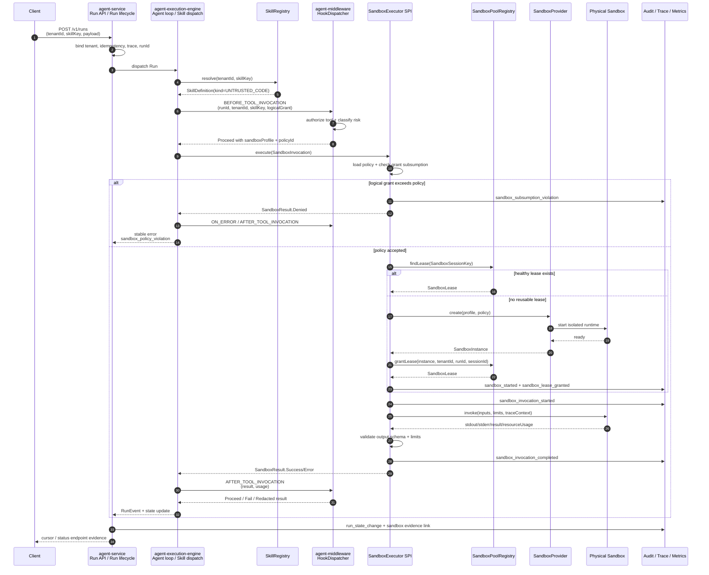
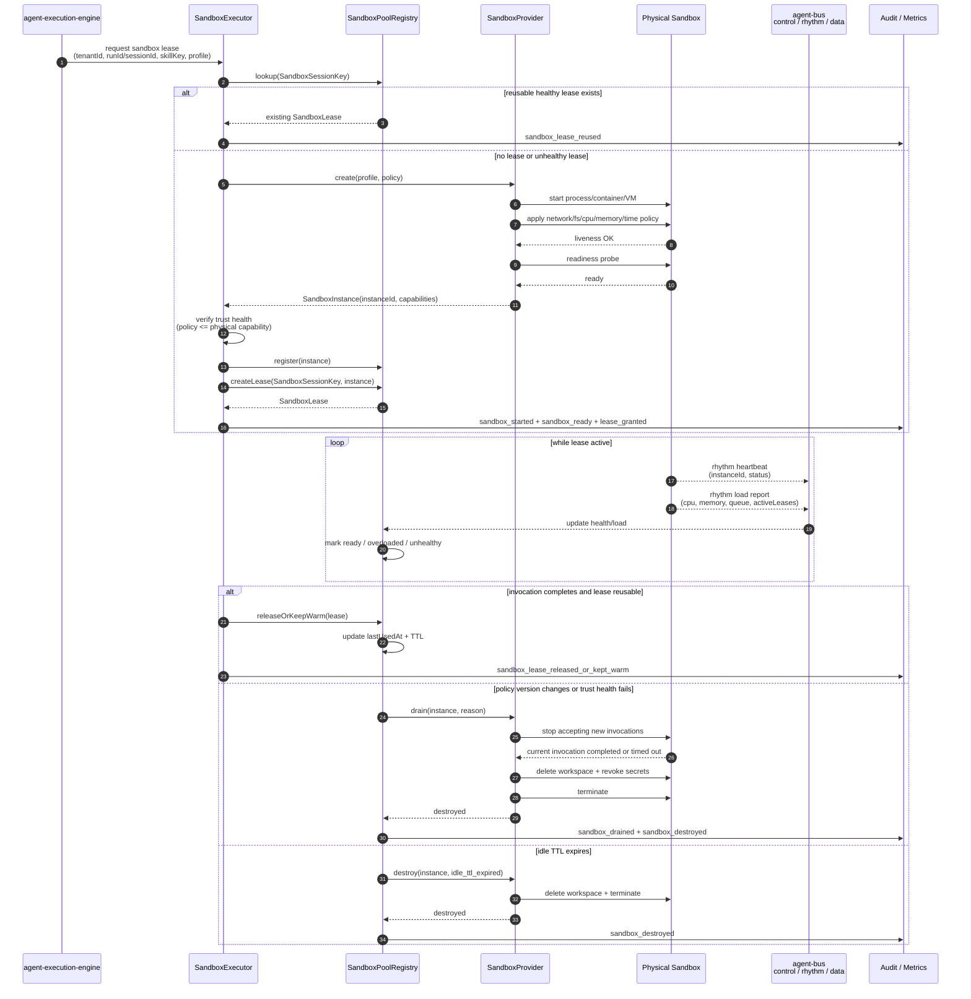

# Sandbox Execution L1 Design Review

## Executive Summary

The repository already recognizes sandbox execution as a trustworthy architecture concern, but the current state is still mostly contract and governance level rather than runtime level.

Existing assets include:

- `SkillKind.UNTRUSTED_TOOL` and `SkillKind.UNTRUSTED_CODE` in the unified Skill SPI.
- `docs/contracts/skill-definition.v1.yaml` with `sandbox_routing`.
- `docs/governance/sandbox-policies.yaml` as the sandbox policy source of truth.
- `agent-middleware` hook points for tool invocation, memory access, error handling, and policy insertion.
- Architectural references that place `SandboxExecutor` under `agent-execution-engine`.
- Trust boundary documentation that treats runtime-to-tools/sandbox as a `runtime_extension` boundary.

What is missing is the runtime execution plane:

- no concrete `SandboxExecutor` SPI in active source;
- no sandbox pool or lease model;
- no sandbox health/readiness/trust-health monitoring;
- no sandbox load model;
- no session affinity model;
- no scale-out or replacement behavior;
- no runtime policy subsumption check;
- no production refusal path for over-wide grants;
- no L1 reference scenario proving that untrusted skill execution is actually isolated, auditable, and recoverable.

The recommended direction is not to turn `agent-middleware` into a sandbox manager. Middleware should remain the policy interception and audit insertion surface. Actual sandbox execution should become an L1 execution boundary owned by `agent-execution-engine`, with a reference adapter wired by `agent-service`, and future multi-sandbox routing coordinated through `agent-bus`.

## Current Repository Reading

### Current Strengths

The codebase already has several good architectural decisions:

1. Skill kinds are closed and explicit.
   `UNTRUSTED_TOOL` and `UNTRUSTED_CODE` are type-level discriminators, which is better than relying on string metadata or convention.

2. Sandbox policy exists as a governance artifact.
   `docs/governance/sandbox-policies.yaml` declares default-deny behavior and required limit dimensions: outbound network, filesystem read, filesystem write, CPU cap, memory cap, and wall-clock cap.

3. Middleware already has the right hook shape.
   `BEFORE_TOOL_INVOCATION`, `AFTER_TOOL_INVOCATION`, and `ON_ERROR` are natural enforcement points for tool authorization, sandbox routing decisions, result filtering, and failure normalization.

4. The design already rejects a seventh "capability services" module.
   This is healthy for the current reactor. Sandbox should be distributed across the existing six modules rather than introduced as a new top-level Maven module.

5. The trust-boundary corpus already names runtime-to-tools/sandbox as a sensitive boundary.
   This means future sandbox work can be reviewed as a trustworthy L1 increment rather than as an isolated implementation detail.

### Current Gaps

The main gaps are runtime closure and operational design:

1. `sandbox-policies.yaml` is schema-shipped, not runtime-enforced.
   It describes target behavior, but runtime policy subsumption is still deferred.

2. The platform has no active sandbox lifecycle.
   There is no first-class model for creating, leasing, checking, scaling, draining, or destroying sandbox instances.

3. Middleware hook delivery is not enough.
   A hook can say "this call requires sandbox", but the execution engine must own the actual sandbox invocation contract.

4. No multi-sandbox scheduling model exists.
   There is no answer yet for session affinity, load balancing, tenant fairness, health-aware routing, or pool warm-up.

5. No audit-grade sandbox event model exists.
   Sandbox start, invocation, denial, timeout, OOM, policy violation, lease migration, and destroy events should become auditable runtime events.

6. No L1 reference scenario proves isolation.
   A trustworthy L1 release should prove at least one untrusted skill can execute in a restricted environment, fail closed on policy violations, and leave traceable evidence.

## Target Architecture

### Responsibility Split

Recommended module ownership:

| Concern | Recommended Home | Rationale |
|---|---|---|
| Skill classification | `agent-middleware` Skill SPI | Skill kind is already part of the unified Skill model. |
| Sandbox execution SPI | `agent-execution-engine` | Sandbox execution is an engine/runtime boundary, not a policy hook implementation. |
| Runtime adapter wiring | `agent-service` | `agent-service` owns Run lifecycle, trace, audit, posture, and boot checks. |
| Policy interception | `agent-middleware` | Middleware should authorize and enrich execution, not manage containers. |
| Multi-sandbox routing and heartbeats | `agent-bus` | The bus already owns cross-plane control, data, and rhythm tracks. |
| Policy source of truth | `docs/governance/sandbox-policies.yaml` | Keep policy-as-contract and promote it to runtime input. |
| Physical isolation | external sandbox runtime | Container, process, VM, microVM, or Kubernetes Pod should be external runtime resources. |

### Core Execution Flow

Recommended L1 flow:

```text
Run / Agent Loop
  -> SkillRegistry.resolve(tenantId, skillKey)
  -> inspect SkillKind
  -> RuntimeMiddleware BEFORE_TOOL_INVOCATION
  -> SandboxRoutingGuard
  -> SandboxExecutor.execute(...)
  -> SandboxPool / SandboxProvider
  -> physical sandbox
  -> SandboxResult
  -> RuntimeMiddleware AFTER_TOOL_INVOCATION
  -> RunEvent + audit + trace
```

Important boundary rule:

Middleware decides whether a call is allowed and what policy envelope applies. It should not create containers, maintain pools, own leases, or collect sandbox heartbeats.

### Sandbox Invocation Sequence

The following sequence shows the recommended runtime path for one untrusted skill invocation.



Key design points:

- the engine never invokes `UNTRUSTED_TOOL` or `UNTRUSTED_CODE` directly;
- middleware controls policy and authorization, but the sandbox executor owns runtime isolation;
- `SandboxExecutor` rejects over-wide grants before sandbox invocation;
- all denial, timeout, completion, and resource usage events produce audit evidence;
- sandbox output is validated before it re-enters Run state or model context.

## Sandbox Domain Model

### Sandbox Profile

A `SandboxProfile` describes a class of sandbox runtime.

Examples:

- `python-code`
- `shell-script`
- `browser-tool`
- `mcp-tool`
- `file-transform`

Suggested fields:

```text
profileId
runtimeKind
imageOrRuntimeRef
defaultPolicyId
startupTimeout
maxLeaseTtl
supportsSessionAffinity
supportsNetworkPolicy
supportsFilesystemPolicy
supportsCpuLimit
supportsMemoryLimit
supportsWallClockLimit
```

### Sandbox Policy

`SandboxPolicy` should be loaded from `docs/governance/sandbox-policies.yaml` or its promoted runtime equivalent.

Minimum fields:

```text
policyId
skillKey
outboundNetwork
filesystemRead
filesystemWrite
cpuCapMillicores
memoryCapMegabytes
wallClockCapSeconds
syscallsProfile
environmentPolicy
secretPolicy
```

The default should remain deny-all.

### Logical Grant

A `SandboxLogicalGrant` is the per-invocation requested capability envelope.

Example:

```text
skillKey = "python-code"
outboundNetwork = deny_all
filesystemRead = workspace:/input/read-only
filesystemWrite = workspace:/output/write-only
cpuCapMillicores = 100
memoryCapMegabytes = 128
wallClockCapSeconds = 30
```

Rule:

The logical grant must be narrower than or equal to the physical sandbox policy. If it is wider, `SandboxExecutor` must reject before invoking untrusted code.

### Sandbox Instance

A `SandboxInstance` is one running isolated environment.

Suggested fields:

```text
instanceId
profileId
status
createdAt
lastHeartbeatAt
tenantBindingMode
activeLeaseCount
load
capabilities
physicalPolicy
```

### Sandbox Lease

A `SandboxLease` binds a Run or Session to a Sandbox Instance.

Suggested fields:

```text
leaseId
tenantId
runId
sessionId
skillKey
sandboxProfile
instanceId
createdAt
expiresAt
lastUsedAt
state
```

Recommended session key:

```text
SandboxSessionKey = tenantId + sessionId/runId + skillKey + sandboxProfile
```

## Should the Platform Create Sandboxes?

Yes, but creation should be mediated by `SandboxProvider`, not embedded in business logic.

Recommended provider abstraction:

```java
interface SandboxProvider {
    SandboxInstance create(SandboxProfile profile, SandboxPolicy policy);
    SandboxHealth health(SandboxInstance instance);
    SandboxLoad load(SandboxInstance instance);
    SandboxResult execute(SandboxLease lease, SandboxInvocation invocation);
    void destroy(SandboxInstance instance, SandboxDestroyReason reason);
}
```

Recommended initial implementations:

| Implementation | Use | Production Suitability |
|---|---|---|
| `NoOpSandboxProvider` | dev-only placeholder | must fail closed in research/prod for untrusted skills |
| `LocalProcessSandboxProvider` | local L1 testing | limited isolation; useful for contract tests |
| `ContainerSandboxProvider` | first practical production path | recommended first serious implementation |
| `KubernetesSandboxProvider` | elastic multi-instance deployment | recommended after pool semantics are stable |
| `MicroVmSandboxProvider` | high isolation | later stage for stronger tenant and kernel isolation |

### Sandbox Lifecycle Sequence

The following sequence describes sandbox instance and lease lifecycle across creation, readiness, reuse, monitoring, draining, and destruction.



Lifecycle rules:

- sandbox readiness must include policy application, not just process startup;
- trust-health failure removes the instance from routing immediately;
- lease reuse is allowed only inside the same tenant/session/run boundary;
- local sandbox workspace must be destroyed or reset before cross-tenant reuse;
- heartbeat and load reports belong on the bus rhythm track once multi-instance routing exists;
- drain must stop new work before destroying the instance.

## Health Monitoring

Sandbox health should not be a single boolean. It should have at least three layers.

### Liveness

Answers: is the sandbox process/container/VM still alive?

Signals:

- process running;
- container state;
- heartbeat freshness;
- provider-level reachability.

Suggested metrics:

```text
sandbox_heartbeat_age_seconds{instanceId,profile}
sandbox_liveness_failure_total{profile,reason}
sandbox_instance_exit_total{profile,reason}
```

### Readiness

Answers: can this sandbox accept a new invocation?

Signals:

- runtime initialized;
- policy applied;
- work directory prepared;
- network restrictions installed;
- filesystem mounts ready;
- current load below threshold.

Suggested metrics:

```text
sandbox_ready_instances{profile}
sandbox_not_ready_total{profile,reason}
sandbox_startup_seconds{profile}
```

### Trust Health

Answers: are the security controls still effective?

Signals:

- network egress policy is active;
- filesystem restrictions are active;
- seccomp/AppArmor or equivalent profile is active;
- no unexpected mount or environment expansion;
- physical capability is not weaker than declared policy.

Suggested metrics:

```text
sandbox_trust_health_failure_total{profile,reason}
sandbox_policy_drift_total{profile,policyId}
sandbox_subsumption_violation_total{skillKey,reason}
```

Trust health is the most important for trustworthy architecture. A live sandbox that lost isolation must be treated as unavailable.

## Load Monitoring

Load should include more than CPU.

Recommended dimensions:

- active leases;
- queued invocations;
- CPU usage;
- memory usage;
- wall-clock budget remaining;
- startup latency;
- invocation p95/p99 latency;
- policy violation rate;
- timeout rate;
- per-tenant concurrency;
- per-skill concurrency;
- warm pool availability.

Suggested metrics:

```text
sandbox_active_leases{profile,tenantId}
sandbox_invocation_queue_depth{profile}
sandbox_cpu_usage_ratio{instanceId}
sandbox_memory_usage_ratio{instanceId}
sandbox_invocation_duration_seconds{profile,skillKey}
sandbox_timeout_total{profile,skillKey}
sandbox_capacity_exhausted_total{profile,tenantId,skillKey}
sandbox_warm_pool_available{profile}
```

## Load Balancing and Session Affinity

### Routing Algorithm

Recommended decision sequence:

1. Resolve `SandboxSessionKey`.
2. If a healthy lease exists and load is acceptable, reuse it.
3. If the lease is unhealthy, expired, or over threshold, create or select another sandbox.
4. If no ready instance exists, try warm pool.
5. If warm pool is empty, ask provider to create a new instance.
6. If creation is not allowed or capacity is exhausted, suspend or reject with stable reason.

### Scoring Model

Recommended scoring shape:

```text
score =
  cpu_weight * cpu_usage
+ memory_weight * memory_usage
+ queue_weight * pending_invocations
+ tenant_fairness_penalty
+ recent_failure_penalty
- session_affinity_bonus
```

Lower score wins.

Session affinity is a preference, not an override. A stale or overloaded sandbox must not be kept only because it owns the previous session.

### Tenant Fairness

Sandbox routing must compose with `SkillCapacityRegistry` and tenant quotas.

Rules:

- tenant quota is checked before sandbox allocation;
- global skill capacity is checked before sandbox allocation;
- sandbox capacity exhaustion should suspend the Run where recoverable;
- untrusted execution should not starve trusted platform work;
- one tenant must not monopolize warm pool capacity.

## Scaling Model

### Scale Up

Create new sandbox instances when:

- queue depth exceeds threshold;
- p95 invocation latency exceeds target;
- warm pool falls below minimum;
- active leases per instance exceed threshold;
- tenant-specific burst policy allows expansion.

### Scale Down

Destroy or drain instances when:

- idle TTL expires;
- trust health fails;
- policy version changes;
- profile runtime version changes;
- repeated invocation failures exceed threshold;
- memory/CPU leak is suspected.

### Draining

When draining:

- stop assigning new leases;
- let current invocation finish or time out;
- persist required outputs through trusted storage;
- emit `sandbox_draining` and `sandbox_destroyed` audit events;
- delete local workspace and secrets.

## Failure Semantics

Sandbox failures need stable platform-level error codes.

Recommended codes:

| Code | Meaning | Run Effect |
|---|---|---|
| `sandbox_policy_violation` | logical grant exceeds policy or prohibited action attempted | fail or deny skill call |
| `sandbox_capacity_exhausted` | no capacity currently available | suspend when retryable |
| `sandbox_startup_timeout` | instance did not become ready | retry or fail based on policy |
| `sandbox_invocation_timeout` | wall-clock exceeded | fail skill call |
| `sandbox_oom` | memory cap exceeded | fail skill call |
| `sandbox_instance_lost` | instance died mid-call | retry if idempotent; otherwise fail |
| `sandbox_trust_health_failed` | isolation controls not effective | fail closed |
| `sandbox_output_invalid` | output schema or result validation failed | fail skill call |

Untrusted sandbox output must be treated as untrusted input. It should be schema-validated, size-limited, redacted where needed, and audited before it re-enters the model or Run state.

## Audit and Trace Requirements

Sandbox execution should emit structured audit events.

Minimum events:

```text
sandbox_lease_requested
sandbox_lease_granted
sandbox_started
sandbox_ready
sandbox_invocation_started
sandbox_invocation_completed
sandbox_invocation_failed
sandbox_policy_denied
sandbox_subsumption_violation
sandbox_timeout
sandbox_oom
sandbox_draining
sandbox_destroyed
```

Required fields:

```text
tenantId
runId
sessionId
skillKey
skillKind
sandboxProfile
policyId
leaseId
instanceId
traceId
decision
reason
resourceLimits
observedUsage
```

This is important for financial-grade trustworthy review. A sandbox design that prevents unsafe execution but cannot prove what happened is not sufficient.

## Middleware Extension Recommendation

`agent-middleware` should be extended, but only as the policy and hook layer.

Recommended additions:

1. `SandboxRoutingMiddleware`
   - fires on `BEFORE_TOOL_INVOCATION`;
   - detects `UNTRUSTED_TOOL` and `UNTRUSTED_CODE`;
   - attaches sandbox profile, policy id, and logical grant;
   - rejects direct execution without sandbox.

2. `ToolAuthorizationMiddleware`
   - checks tenant, actor, tool scope, and skill permissions;
   - prevents prompt-controlled tool expansion.

3. `SandboxResultRedactionMiddleware`
   - fires on `AFTER_TOOL_INVOCATION`;
   - validates output schema;
   - redacts sensitive data;
   - limits result size.

4. `SandboxFailureNormalizationMiddleware`
   - fires on `ON_ERROR`;
   - maps provider-specific failures to stable platform error codes.

Recommended `HookContext` fields:

```text
runId
tenantId
sessionId
traceId
skillKey
skillKind
sandboxProfile
policyId
logicalGrant
actorId
```

Middleware should not own:

- sandbox creation;
- container lifecycle;
- sandbox pool management;
- lease persistence;
- load balancing;
- heartbeat collection.

## L1 Module Implementation Plan

### Step 1: `agent-execution-engine` Sandbox SPI

Add pure Java SPI types:

```text
SandboxExecutor
SandboxInvocation
SandboxResult
SandboxPolicy
SandboxLogicalGrant
SandboxProfile
SandboxInstance
SandboxLease
SandboxHealth
SandboxLoad
SandboxProvider
SandboxSubsumptionViolation
```

Acceptance criteria:

- SPI imports only `java.*` and allowed same-package types.
- `UNTRUSTED_TOOL` / `UNTRUSTED_CODE` cannot be represented as direct execution without sandbox.
- Policy subsumption is part of the SPI contract.

### Step 2: `agent-service` Reference Adapter

Add a minimal adapter and boot guard:

- dev-only `NoOpSandboxExecutor`;
- test-oriented `LocalProcessSandboxProvider` or mock provider;
- research/prod boot failure if untrusted skills exist and only NoOp sandbox is active;
- sandbox audit event emitter;
- trace propagation into sandbox invocation.

Acceptance criteria:

- research/prod fail closed for untrusted skills without sandbox;
- sandbox invocation produces audit and trace evidence;
- timeout and policy violation have stable error codes.

### Step 3: `agent-middleware` Policy Hooks

Add middleware implementations for sandbox routing and result handling.

Acceptance criteria:

- `BEFORE_TOOL_INVOCATION` blocks direct execution of untrusted kinds;
- `AFTER_TOOL_INVOCATION` validates and redacts outputs;
- middleware failures do not silently proceed into unsafe execution.

### Step 4: `agent-bus` Future Pool Coordination

Introduce bus-facing contracts for:

- sandbox heartbeat;
- sandbox load report;
- sandbox lease event;
- sandbox invocation event;
- sandbox drain command.

Recommended channel mapping:

| Bus Track | Sandbox Use |
|---|---|
| control | allocate, cancel, drain, destroy |
| data | invocation request/result payload references |
| rhythm | heartbeat and load report |

Acceptance criteria:

- heartbeat and load are separable from payload flow;
- cancel can reach an active sandbox lease;
- pool state can recover after service restart.

### Step 5: Runtime Policy Promotion

Promote `docs/governance/sandbox-policies.yaml` from schema-shipped to runtime-consumed.

Acceptance criteria:

- application loads the policy at startup;
- invalid policy fails startup;
- policy id/version is recorded in audit events;
- over-wide logical grants are refused before execution.

## L1 Reference Scenario

The first L1 trustworthy sandbox scenario should be small but complete:

```text
1. Register one UNTRUSTED_CODE skill.
2. Start service in research/prod posture.
3. Verify startup fails if only NoOpSandboxExecutor is available.
4. Start service with a non-NoOp test sandbox executor.
5. Submit POST /v1/runs for that skill.
6. BEFORE_TOOL_INVOCATION checks sandbox policy.
7. SandboxExecutor obtains a lease.
8. The sandbox executes a restricted script.
9. Network/file overreach is denied.
10. Result is schema-validated and returned.
11. Audit events record start, invocation, completion/denial, and resource use.
12. GET /v1/runs/{id} shows traceable final state.
```

Minimum negative tests:

- untrusted skill with NoOp sandbox in research/prod fails startup;
- logical grant wider than policy is rejected;
- network access outside allowlist is denied;
- filesystem write outside allowed path is denied;
- wall-clock timeout is enforced;
- output schema violation is rejected;
- cross-tenant session lease reuse is impossible.

## Trustworthy Design Red Lines

The following rules should be non-negotiable:

1. `UNTRUSTED_TOOL` and `UNTRUSTED_CODE` must never execute through NoOp in research/prod.
2. Logical grants must never exceed physical sandbox policy.
3. Sandbox local state must not be the trusted state source.
4. Sandbox output must be validated as untrusted input.
5. Policy violations must be audited.
6. Timeout, OOM, network denial, and filesystem denial must have stable error codes.
7. Session affinity must not weaken tenant isolation.
8. Load balancing must respect tenant quota and skill capacity.
9. Trust-health failure must remove the sandbox from service.
10. Middleware must not become an implicit bypass around `SandboxExecutor`.

## Review Addendum: Gaps To Tighten

After reviewing this report as a design artifact, the main omission was not the core routing model. The routing model is sound. The under-specified areas are the operational and assurance details that a financial-grade trustworthy review will likely challenge.

### Supply Chain and Runtime Image Trust

Sandbox isolation is only as trustworthy as the runtime image or interpreter it launches. The L1 design should add explicit requirements for:

- sandbox image digest pinning;
- SBOM generation for sandbox images;
- vulnerability scan evidence before promotion;
- approved base image list;
- runtime version pinning for Python, shell, browser, or tool runtimes;
- policy for rebuilding images after critical CVEs;
- audit event field for `runtimeImageDigest` or equivalent runtime identity.

Without this, a sandbox can be isolated but still run an untrusted or stale runtime.

### Secret Injection and Revocation

The report mentions secret scope, but the lifecycle design should be stricter:

- secrets should be short-lived and scoped to a single lease or invocation;
- secrets must never be passed through model-visible prompt text;
- secrets must not be present in stdout, stderr, result payloads, or audit details;
- lease destruction must revoke or expire issued credentials;
- sandbox logs should be scanned or filtered before persistence;
- secret access should be auditable as a distinct event.

Recommended audit events:

```text
sandbox_secret_issued
sandbox_secret_denied
sandbox_secret_revoked
sandbox_secret_redacted_from_output
```

### Output Channels and Data Exfiltration

The report correctly says sandbox output must be treated as untrusted input, but it should explicitly cover all output channels:

- stdout;
- stderr;
- files written to allowed output mounts;
- network responses;
- callback payloads;
- generated artifacts;
- error messages;
- timing and size side channels where practical.

L1 does not need to solve every covert channel, but it should state that stdout/stderr and generated files are not trusted just because they came from a sandbox.

### Retry, Idempotency, and Side Effects

Sandbox invocation retry is risky. If a sandbox dies mid-call, the platform must know whether the skill is safe to retry.

Recommended fields on `SandboxInvocation` or `SkillDefinition`:

```text
sideEffectLevel: none | idempotent_external | non_idempotent_external
retryPolicy: never | retry_same_lease | retry_new_lease
idempotencyKey
externalEffectRef
```

Rules:

- code-only computation may be retried when inputs are stable;
- external tool calls must require an idempotency key or be non-retryable;
- retries must emit audit events;
- partial output from failed attempts must not be merged silently.

### Forced Termination Semantics

Lifecycle drain is not enough. The design should also define hard kill behavior:

- graceful cancel timeout;
- forced kill timeout;
- cleanup after forced kill;
- how Run status changes after kill;
- whether partial artifacts are retained, quarantined, or deleted;
- how to audit operator-initiated kill versus policy-initiated kill.

Recommended error codes:

```text
sandbox_cancelled
sandbox_force_killed
sandbox_cleanup_failed
sandbox_artifact_quarantined
```

### Policy Versioning and Compatibility

The report recommends recording `policyId`, but L1 should require a policy version and compatibility rule:

- every invocation records `policyId` and `policyVersion`;
- leases are invalidated when a stricter policy version lands;
- existing leases are drained when a runtime image or policy changes;
- old policy versions are retained long enough for audit replay;
- release notes must say whether a policy change is backward compatible.

### Isolation Attestation

Trust health should include evidence, not only status. For stronger environments, the platform should capture:

- container runtime id or VM id;
- kernel/user namespace isolation mode;
- seccomp/AppArmor/SELinux profile id;
- network policy id;
- mounted volume list;
- effective user/group id;
- disabled privileged mode check;
- physical capability summary used by subsumption.

This can start as structured metadata in audit and later become attestation evidence.

### Operator Controls and Emergency Disable

The report mentions drain and destroy, but not enough operator control. L1 should add:

- disable one sandbox profile;
- disable one skill;
- disable all untrusted execution;
- drain all sandboxes for one tenant;
- quarantine one sandbox instance;
- export sandbox audit bundle for incident review.

These controls belong in `agent-service` runbooks first, and later in operator APIs.

## Codebase Improvement Recommendations

### High Priority

1. Add a real `SandboxExecutor` SPI under `agent-execution-engine`.
2. Add a research/prod boot guard for untrusted skills without non-NoOp sandbox.
3. Load `sandbox-policies.yaml` as runtime configuration.
4. Implement policy subsumption checks.
5. Add sandbox audit events and trace propagation.
6. Add L1 reference scenario tests.

### Medium Priority

1. Add `SandboxRoutingMiddleware`.
2. Add `SandboxResultRedactionMiddleware`.
3. Add sandbox metrics.
4. Add `SandboxLease` and `SandboxSessionKey`.
5. Add a simple local or container reference provider.
6. Add pool readiness and liveness checks.

### Later Priority

1. Add Kubernetes or microVM sandbox providers.
2. Move sandbox heartbeat/load into `agent-bus` rhythm track.
3. Add warm pool scaling.
4. Add lease migration and drain behavior.
5. Add tamper-evident audit storage.
6. Add sandbox incident replay tooling.

## Recommended L1 Claim Boundary

Before implementation, the repository may claim:

> The architecture defines sandbox policy and untrusted skill routing requirements, but runtime sandbox enforcement is not yet shipped.

After Step 1 and Step 2, it may claim:

> The platform has an L1 sandbox execution SPI and a reference adapter proving fail-closed startup, policy subsumption, timeout handling, audit emission, and trace propagation for one untrusted skill path.

Only after pool, health, load, and multi-instance routing are implemented should it claim:

> The platform supports managed sandbox execution with health-aware routing and capacity-aware scheduling.

## Final Recommendation

The best next L1 investment is:

1. `agent-execution-engine`: define the sandbox execution SPI.
2. `agent-service`: wire a minimal reference executor and boot guard.
3. `agent-middleware`: enforce routing and result policies through hooks.
4. `agent-bus`: later own multi-sandbox heartbeat, load, and routing coordination.

This keeps the design aligned with the current six-module architecture while turning sandbox from a design-only trustworthy concern into an auditable, testable L1 runtime capability.

## Rendered Sequence Diagram Images

The Mermaid sequence diagrams above are also provided as standalone SVG images for readers or tools that do not render Mermaid blocks.

### Sandbox Invocation Sequence Image


### Sandbox Lifecycle Sequence Image


